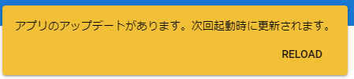

############
アクセス方法
############

ウェブアプリ版
======================

URL
-----

https://vrmviewmeister.azurewebsites.net

gitのソースからローカルでホスティングする場合はビルドとホスティングの手順後にブラウザで下記を実行するとローカルでもPWAによるアプリ表示が行なえます。

|

.. index:: インストール方法（ウェブアプリ）

インストール
--------------------------------

　アクセスするとブラウザのURLバーの右端にこのようなアイコンが表示されます。左端のアイコンをクリックしてインストールを進めてください。

.. image:: ../img/install01.png

　Edgeの場合は「・・・」→「アプリ」からもインストールを行えます。

.. |logo| image:: ../img/install03.png

|logo|　インストールが完了するとWindowsやmacOS、Linuxのメニュー一覧にこのように専用のアイコン付きで表示されるようになります。

|

.. note::
    ※ブラウザでウェブサイトを開くだけなのにインストールとは？

    | 　ブラウザで開くだけなのにインストール？と思われる方もいらっしゃるかと思います。本アプリはPWA（Progressive Wab App）という、ウェブサイトをPCのネイティブアプリのようにブラウザから分離して使うことのできる技術を採用しています。
    | 　インストールすることで本アプリもChromeやEdgeから完全に切り離され、ブラウザを起動していなくても使うことができます。
    | 　本アプリはUnityの機能を使っているため環境によっては重くなります。インストールしておくことで、普通にウェブサイト閲覧に使いたいChromeやEdgeなどまで重くなることを防ぐことができます。ぜひインストールしてご利用ください。

アプリのアップデート
---------------------------------------

ウェブアプリ版は更新は自動で行われます。更新があると次のようなメッセージが画面右上に表示されます。

この後、再読み込みするとアプリが最新の状態に更新されます。

|

.. index:: アンインストール（ウェブアプリ）

アンインストール
-------------------------------------

　アンインストールすることで本アプリをブラウザから削除することができます。合わせて本アプリが使用していたデータも削除できます。
　ここではChromeとEdgeを例に説明いたします。

Chromeの場合
^^^^^^^^^^^^^^^^^^

.. |uninst01| image:: ../img/uninstall01.png

|uninst01| 　ブックマークバーにある「アプリ」をクリックします。

.. image:: ../img/uninstall02.png
    :scale: 60
    :align: left

　本アプリを探し、右クリックして「Chromeから削除」をクリックします。

　下図のメッセージが表示されるので、必要に応じてチェックボックスにチェックを入れて「削除」ボタンを押してください。

.. image:: ../img/uninstall03.png
    :scale: 70%

Edgeの場合
^^^^^^^^^^^^^^^

.. |uninst04| image:: ../img/uninstall04.png

|uninst04| 「・・・」→「アプリ」から「アプリの管理」をクリックします。

本アプリを探し、右端の「×」ボタンをクリックします。

.. image:: ../img/uninstall05.png

Chromeと同様にメッセージが表示されるので必要に応じてチェックボックスにチェックを入れて「削除」ボタンを押してください。

|

.. index:: 
    PC版

PC版
========================================

.. index:: インストール（PC版）

インストール
--------------------------------

　PC版は普通のPCアプリのため、各OSのインストール・アップデート方法に従って使います。

Windows
^^^^^^^^^^^^^^^

Windowsの手順です。

1. 7zファイルをダウンロードしたら、適当な場所で解凍してください。

2. 中にある ``vrmviewmeister.exe`` をダブルクリックして起動してください。

.. image:: ../img/install05.png

このように起動します。

.. image:: ../img/install_win.png

|

macOS
^^^^^^^^^^^
..
    .. caution::
        | 今後パッケージ化に成功したら正式な手順を掲載します。以下はソースからビルドして起動する場合です。
        | 必ずウェブアプリ版や他OS版を試して当方を信頼できる、と判断した場合のみソースからビルド・実行をしてください。
        | この場合、ご利用端末で問題が発生した場合に責任は保証できませんのでご了承ください。

    1. Node.jsやPythonをインストールします。
    #. githubから ``git clone`` をしてリポジトリをダウンロードします。
    #. README.mdに記載の通り、次のコマンドを順次実行していきます。

    .. code-block:: bash

        $ npm install
        $ npm run wpbuild
        $ npm run swbuild
        $ npm run compile:electron
        $ npm run electron

    ※パッケージをビルドして実行する場合

    .. code-block:: bash

        $ npm run build:mac

        ※後はFinder上で dist/ 内の vrmviewmeisterを実行します。

1. ダウンロードした ``vrmviewmeister.app.zip`` を解凍します。
2. 中にある ``vrmviewmeister`` をダブルクリックして起動してください。

.. image:: ../img/install_mac.jpg

※本当にインストールする際はmacOSのアプリのインストール方法に沿って実施してください。

|

Linux
^^^^^^^^^^^

1. ダウンロードした ``vrmviewmeister-[バージョン番号].AppImage`` をダブルクリックして起動してください。

.. image:: ../img/install_linux.jpg

.. warning::
    仮想環境のLinuxではUnityや各ライブラリの仕様により、VRMやFBXなどを端末から読み込むことができません。必ず実機でご確認ください。

|

.. index:: アンインストール（PC版）

アンインストール
------------------------------------------

レジストリは使用していません。アンインストール時はフォルダごと削除してください。

また、個人データは下記のフォルダにありますので合わせて削除してください。

.. code-block:: shell

    Windows:
    C:\Users\[ユーザー名]\AppData\Roaming\vrmviewmeister

    macOS:
    ~/Library/Application Support/vrmviewmeister

    Linux:
    ~/.config/vrmviewmeister

.. raw:: latex

   \cleardoublepage

