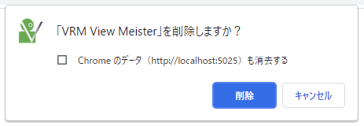

############
アクセス方法
############

URL
-----
https://vrmviewmeister.azurewebsites.net

|

インストール方法（ウェブアプリ）
--------------------------------

　アクセスするとブラウザのURLバーの右端にこのようなアイコンが表示されます。左端のアイコンをクリックしてインストールを進めてください。

.. image:: ../img/install01.png

　Edgeの場合は「・・・」→「アプリ」からもインストールを行えます。

.. image:: ../img/install02.png

|logo|　インストールが完了するとWindowsやmacOS、Linuxのメニュー一覧にこのように専用のアイコン付きで表示されるようになります。

|

**※ブラウザでウェブサイトを開くだけなのにインストールとは？**

　ブラウザで開くだけなのにインストール？と思われる方もいらっしゃるかと思います。本アプリはPWA（Progressive Wab App）という、ウェブサイトをPCのネイティブアプリのようにブラウザから分離して使うことのできる技術を採用しています。

　インストールすることで本アプリもChromeやEdgeから完全に切り離され、ブラウザを起動していなくても使うことができます。

　本アプリはUnityの機能を使っているため環境によっては重くなります。インストールしておくことで、普通にウェブサイト閲覧に使いたいChromeやEdgeなどまで重くなることを防ぐことができます。ぜひインストールしてご利用ください。

|

インストール（スタンドアロン版）
--------------------------------

　スタンドアロン版は普通のアプリのようにPCにインストールして使います。本アプリではWindowsにまず対応しています。（macOS、Linux版は今後公開予定）

1, 7zファイルをダウンロードしたら、適当な場所で解凍してください。

.. image:: ../img/install04.png

2, 中にある「vrmviewmeister.exe」をダブルクリックして起動してください。

|

アンインストール方法（ウェブアプリ）
-------------------------------------

　アンインストールすることで本アプリをブラウザから削除することができます。合わせて本アプリが使用していたデータも削除できます。
　ここではChromeとEdgeを例に説明いたします。

Chromeの場合
==============

.. |uninst01| image:: ../img/uninstall01.png

|uninst01| 　ブックマークバーにある「アプリ」をクリックします。

.. image:: ../img/uninstall02.png
    :scale: 60
    :align: left

　本アプリを探し、右クリックして「Chromeから削除」をクリックします。

　下図のメッセージが表示されるので、必要に応じてチェックボックスにチェックを入れて「削除」ボタンを押してください。

Edgeの場合
============

.. |uninst04| image:: ../img/uninstall04.png

|uninst04| 「・・・」→「アプリ」から「アプリの管理」をクリックします。

本アプリを探し、右端の「×」ボタンをクリックします。

Chromeと同様にメッセージが表示されるので必要に応じてチェックボックスにチェックを入れて「削除」ボタンを押してください。

|

アンインストール方法（スタンドアロン版）
------------------------------------------

レジストリは使用していません。アンインストール時はフォルダごと削除してください。

また、個人データは下記のフォルダにありますので合わせて削除してください。

.. code-block:: shell

    Windows:
    C:\Users\[ユーザー名]\AppData\Roaming\vrmviewmeister

    macOS:
    ~/Library/Application Support/vrmviewmeister

    Linux:
    ~/.config/vrmviewmeister
