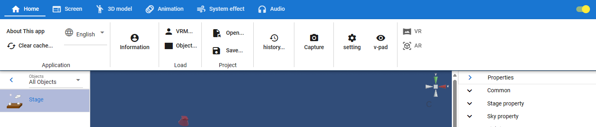
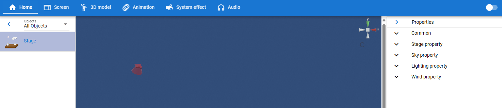
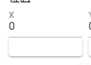

.. index:: メニューの構成
.. index:: リボンバー

###############
メニューの構成
###############

　リボンバー（タブ）にある機能を紹介していきます。

.. contents::

各タブ
######################

.. toctree::
    :maxdepth: 2

    menu_home
    menu_screen
    menu_model
    menu_animation
    menu_syseffect
    menu_audio

.. index:: リボンバーの開閉

リボンバーの開閉
######################

リボンバーの右端のトグルスイッチをオフにすると、リボンバーをたたむことができます。 ver 2.6.0より対応しました。

リボンバーを閉じることでWebGL画面が広くなります。

.. csv-table::

    開いた状態, |ribbonbar_show|
    閉じた状態, |ribbonbar_hidden|

.. admonition:: リボンバーを畳んだ状態でタブを開く

    リボンバーを畳んだ状態で開くと、リボンバーのタブはWebGL画面やプロパティパネルの上に覆いかぶさるように表示されます。

    .. image:: ../img/screen_ribbon_toggle_show3.png
        :align: center

    |

    この状態でなにかメニューを実行するか、リボンバーのパネル名をクリックすると閉じることができます。

スワイプパネル
#######################################

ver 2.8.0よりリボンバーの各パネルにも導入しました。

* リボンバーの全ての数値の入力ボックス

:左にスワイプ, 下にスワイプ, 左ボタン: 値の減少

:右にスワイプ, 上にスワイプ, 右ボタン: 値の増加

.. caution::
    スペースの関係上、入力ボックスの直下ではなく、真横に配置している場合もあります。
