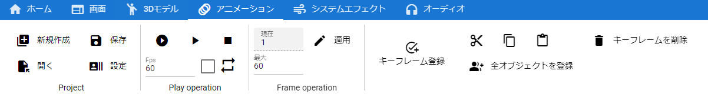

.. index:: アニメーションタブ（リボンバー）

####################################
アニメーションタブ
####################################

| 

　アニメーションに関する機能のボタンがあります。

**Project 内**

:新規作成:
    アニメーションプロジェクトを新規作成します。
:開く:
    既存のアニメーションプロジェクトファイルを開きます。
:保存:
    現在のアニメーションプロジェクトをファイルに保存します。
:設定:
    アニメーションプロジェクトの設定画面を開きます。

.. note::
    ※保存は名前をつけて保存、上書き保存ができます。

**Play operation 内**

:最初から再生:
    １フレーム目からアニメーションを再生します。
:途中から再生・一時停止:
    アニメーションを再生、あるいは一時停止します。
:停止:
    アニメーションを完全に停止します。
:ループ:
    ループ再生をオン・オフ切り替えます。

..
    :デフォルトの間隔:
        現在のアニメーションプロジェクトにおいて、1フレーム間の秒数を指定します。デフォルトでは ``FPS / 6000.0`` の計算結果がセットされます。
    
* デフォルトの間隔はプロジェクトの設定に移動しました。

**Frame operation 内**

:現在:
    現在選択中のフレームNoです。変更するとその位置に移動し、ポーズを適用します。
:最大:
    フレームの最大数を変更します。減らすとその位置のキーは削除されるのでご注意ください。
:適用:
    変更した最大フレーム数を実際に適用します。

**Key operation 内**

:キーフレームを登録...:
    **ver 2.1.0以降** 
    キーフレームの登録ウィンドウを表示します。
    表示されるウィンドウはリボンバーのタブ内ならどこで右クリックしても表示されます。
    
    
:切り取り・コピー・貼付け:
    現在のオブジェクトのキーフレームを各種操作します。
:キーフレームを削除...:
    現在の選択中のタイムラインのキーフレームを削除します。選択中の3Dオブジェクトではありませんので注意してください。

    :削除できる内容:
        * キーフレーム自体
        * プロパティのみ

    | 　プロパティだけを削除することで、そのキーフレームは移動や回転などの共通プロパティの内容だけになります。
    | 　なお、プロパティのみ削除した場合はまだキーフレーム自体は削除されず残った状態です。タイムラインから完全に削除するには ``キーフレームを削除`` の方を選んでください。

