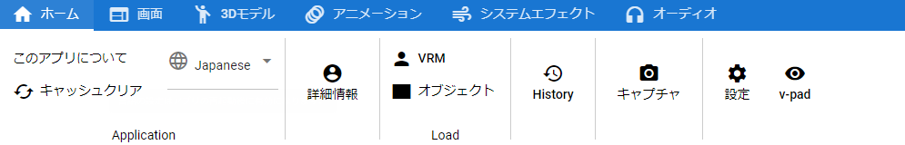

.. index:: ホームタブ（リボンバー）

####################################
ホームタブ
####################################

    

| 

　ホームにはよく使う機能のボタンを集めてあります。

Application
    :このアプリについて:
        本アプリのロゴを表示します。
    :キャッシュクリア:
        ファイルの開いた履歴や一時ファイルを一括で削除します。

        .. image:: ../img/screen_ribbon_home_clearcache.png

        | 
        
        .. list-table::

            * - WebGLの動作を整理する
              - HTMLのUIを操作したときにWebGL内が動かなくなったときに動作をチェックして不要なキャッシュをクリアします。 
            * - アプリのキャッシュをクリアする
              - アプリ内で一時的に保持するだけのデータをまとめて削除します。 
            * - アプリの設定を削除する
              - アプリの設定で示される設定内容をすべて削除してデフォルトの状態に戻します。 
        
    :言語選択:
        本アプリのUI言語を切り替えます。一部UIは次回起動後に反映されます。

:詳細情報:
    選択したVRMの情報を表示します。

Load
    :VRM:
        VRMを開いて読み込みます。
    :オブジェクト:
        FBXやOBJなどを開いて読み込みます。

Project
    :開く:
        既存のアニメーションプロジェクトファイルを開きます。
    :保存:
        現在のアニメーションプロジェクトをファイルに保存します。このタブでは **上書き保存** と同等です。

:履歴:
    一度開いたことの各オブジェクト（VRM、OtherObject、画像）を開くダイアログを表示します。

:キャプチャ:
    現在のWebGLの画面をスクリーンショットを撮って保存します。

:設定:
    本アプリの設定画面を表示します。
:v-pad:
    メインカメラの操作パッドを表示します。