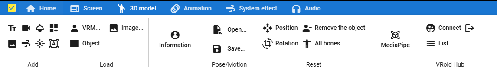

.. index:: モデルタブ（リボンバー）

####################################
モデルタブ
####################################

| 

　3Dモデルに関する機能のボタンがあります。

**Add内（上の行4つ、下の行3つ）**
    :テキスト:
        WebGL画面にテキストを追加します。
    :カメラ:
        WebGL画面にカメラを追加します。これはサブカメラとなります。
    :スポットライト:
        WebGL画面にスポットライトを追加します。
    :基本の図形:
        球体や平面、四角形などまっさらなオブジェクトを追加します。
    :UI画像:
        WebGL画面に画像を2Dとして追加します。これは3Dオブジェクトではありません。
    :エフェクト:
        WebGL画面にエフェクトを追加します。
    :ポイントライト:
        WebGL画面に一定範囲の空間を照らすライトを追加します。

**Load 内**
    　それぞれ、 ``ファイルから`` , ``Googleドライブから選択`` , ``サンプルデータ`` のメニューを使用可能です。

    :ファイルから:
        PCなどの端末から直接ファイルを読み込みます。
    :Googleドライブから選択:
        別途ダイアログを表示し、対象のファイルを選択して読み込みます。
    :サンプルデータ:
        本アプリのサーバに用意した各モデルデータを利用できます。

    各オブジェクト別
        :VRM:
            VRoid(VRM)を読み込んで読み込みます。
        :オブジェクト:
            FBXやOBJなどを開いて読み込みます。
        :Image:
            画像を3Dオブジェクトとして読み込みます。読み込んだ後はFBXやObjと同様に操作できます。
        :詳細情報:
            選択したVRMの情報を表示します。VRM以外では機能しません。

**Pose/Motion 内**
    :開く:
        従来の ``一覧`` をこのメニューに変更しました。

        .. image:: ../img/screen_ribbon_model_01.png
            :align: center

        アプリ用ポーズ、アプリ用モーション
            それぞれのタブが選択された状態でポーズ・モーション一覧ダイアログが開きます。

        VRMAnimation
            下記のいずれかから開きます。

            ``端末`` , ``内部ストレージ``

    :保存:
        ポーズ保存とモーション保存のメニューを表示します。

        .. image:: ../img/screen_ribbon_model_02.png
            :align: center

        各フォーマットごとにサブメニューがあります。それぞれをクリックするとさらに保存先の場所やフォーマットを選択します。

        アプリ用ポーズ・アプリ用ポーズ
            ``端末`` , ``内部ストレージ`` , ``Google Drive``

        モーション：汎用形式
            汎用形式としては ``.anim`` に対応します。

        VRMAnimation 
            ``端末`` , ``内部ストレージ``
    

**Reset operation 内**
    :位置をリセット:
        選択した3Dオブジェクトの位置を初期位置にリセットします。
    :回転をリセット:
        選択した3Dオブジェクトの回転を初期角度にリセットします。
    :モデルを削除:
        選択した3Dオブジェクトをアプリから削除します。
    :全ボーンをリセット:
        選択したVRMの全身のボーンとIKの位置・回転をすべてリセットします。（Tポーズに戻ります）

**その他**
    :MediaPipe:
        AIによるポーズトラッキング機能を使用します。

**VRoid Hub**
    :接続:
        VRoid Hubに接続開始します。VRoid Hubへのログイン後、接続確認ページが表示されます。
    :ログアウト:
        VRoid Hubと本アプリの接続を解除し、ログイン状態を解除します。
    :一覧:
        いずれかをクリックするとモデル選択画面が表示されます。

        * ユーザー作成モデル
        * お気に入り
        * スタッフおすすめ
