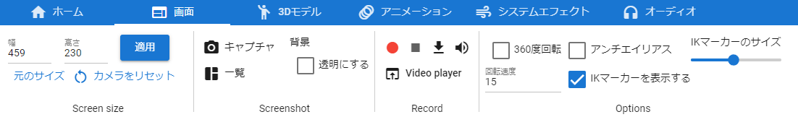

.. index:: 画面タブ（リボンバー）

####################################
画面タブ
####################################

| 

　画面に関する機能のボタンがあります。

**Screen size内**

:画面サイズ:
    WebGL画面の幅と高さを自由に指定します。
:適用:
    入力したサイズを反映します。
:元のサイズ:
    現在のアプリのサイズに合わせてWebGL画面のサイズを戻します。
:カメラをリセット:
    メインカメラの位置をデフォルトに戻します。（ショートカット：Rキー）
:Navigation:
    ナビゲーションの小ウィンドウを表示します。

**Screenshot 内**

:キャプチャ:
    現在のWebGLの画面をスクリーンショットを撮って保存します。
:一覧:
    撮ったスクリーンショットを表示・管理するウィンドウを表示します。
:背景を透過:
    スクリーンショット時、WebGL画面の背景部分を透過にします。

**Record movie 内**

:録画:
    WebGL画面を録画開始します。停止するまで操作・アニメーションした内容がすべて記録されます。
:停止:
    録画を停止します。
:ビデオをダウンロード:
    録画した内容をダウンロードします。形式はwebm形式です。
:音声を有効・ミュート:
    録画する映像の音声をミュートまたは再び有効化します。
:Video player:
    内蔵のビデオプレイヤーを別ウィンドウで開きます。

**Options 内**

:360度回転:
    現在選択中のオブジェクトを中心に360度カメラを回転させます。
:回転速度:
    回転の速度を調整します。
:アンチエイリアス:
    WebGL画面にアンチエイリアスを適用します。
:IKマーカーを表示する:
    各オブジェクトを操作する際のIKマーカーの表示を切り替えます。VR/AR空間でのIKマーカーの表示とは連動していません。
:IKマーカーのサイズ:
    IKマーカーの大きさを変更します。（0.01～0.2）
:オニオンスキン:
    オニオンスキン機能を有効・無効を切り替えます。
