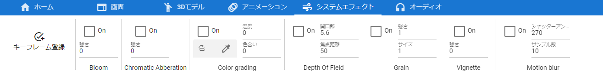

.. index:: システムエフェクトタブ（リボンバー）

####################################
システムエフェクトタブ
####################################

| 

　システムエフェクト（画面の効果）に関する機能のボタンがあります。

　システムエフェクトとは、Unityの用語でいうところのPost-processingです。UnityのPost-processingのすべてが使えるわけではありません。

:On:
    各エフェクトを有効・無効切り替えます。使用可能なエフェクトは次のとおりです。

::
    
    Bloom、Chromatic Abberation、Color grading、Depth of field、Grain、Vignette、Motion blur

.. hint::
    ``ver 2.1.0`` よりシステムエフェクトのキーフレームへの登録は他のオブジェクトと同様にキーフレームの登録ウィンドウから行えるように統一しました。
    **ただし、システムエフェクトタブを開いている必要があります。**