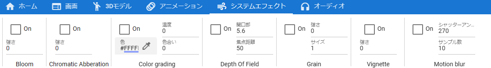

####################################
システムエフェクトタブ
####################################

| 

　システムエフェクト（画面の効果）に関する機能のボタンがあります。

　システムエフェクトとは、Unityの用語でいうところのPost-processingです。UnityのPost-processingのすべてが使えるわけではありません。

**キーフレーム登録**・・・現在設定してあるシステムエフェクトの状態をキーフレームに登録します。
**On**・・・各エフェクトを有効・無効切り替えます。
使用可能なエフェクトは次のとおりです。

::
    
    Bloom、Chromatic Abberation、Color grading、Depth of field、Grain、Vignette、Motion blur