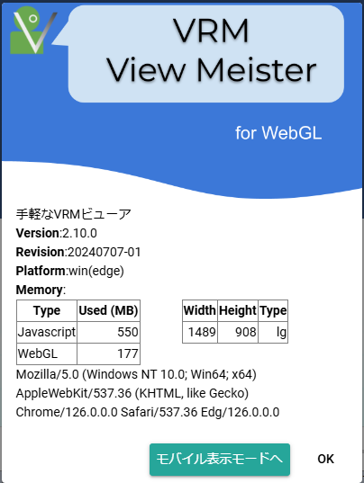

.. index:: このアプリについて（画面の構成）

###########################
このアプリについて
###########################

本アプリのバージョンや概要を確認できます。

|

確認できる情報
####################

    :Version: バージョン番号です。
    :Revision: ビルド番号や同じバージョンでも区別をつける場合に使用する番号です。
    :Platform: アプリを起動しているプラットフォームやブラウザの情報です。
    :Memory: WebGLとJavascriptの使用メモリです。
    :Width,Height,Type: 画面サイズです。
    :UserAgent: アプリを実行している環境の詳細な情報です。

.. _changedisplaymode:

ボタン類
#######################

    :通常表示モード: モバイル表示モードの場合、通常表示の画面に切り替えます。

    :モバイル表示モード: 通常表示モードの場合、モバイル表示に最適化した画面に切り替えます。

