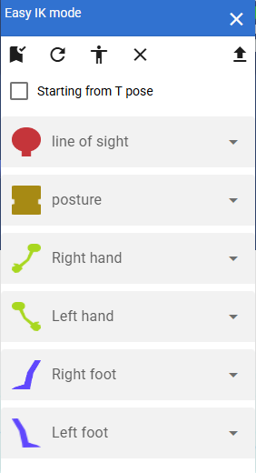

.. index:: IKマーカーの位置変更（画面の構成）

####################################
IKマーカーの位置変更
####################################

.. contents::

入力モード
######################################

.. image:: ../img/screen_ikmarker.png
    :align: center

　VRoid/VRMの場合に使う機能です。本アプリで用いるモデルの体パーツの位置と回転を直接指定できます。別ウィンドウが開きます。アプリとは別ウィンドウです。

| ver 2.9.0より、設定によりアプリのメインウィンドウ内部に表示することもできるようになりました。
| ver 2.13.0より、 ``入力モード`` と名称をつけました。

**上部：**

:ポーズを適用:
    下部のスプレッドシートで指定した値でポーズを適用。
:再読み込み:
    現在のポーズの情報を再読み込みする。
:ポーズを反転する:
    現在のポーズの値を左右逆転する

**下部：**

スプレッドシート:
    体の部位ごとのPosition（位置）・Rotation（回転）を数値で指定する。

.. note::
    * このウィンドウを表示している最中もVRoid/VRMを直接移動・回転できますが、仕様によりすぐにこのウィンドウのスプレッドシートには反映されません。再読み込みボタンを押すことで位置・回転の情報がすぐに取得できます。
    * オブジェクトの選択を変えた時、タイムラインのキーフレームの選択を変更した時には自動的に再読み込みされます。
    * VRM以外を選択した場合はスプレッドシートは使用できなくなります。

簡単IKモード
###############################

.. |easyik_mobile| image:: ../img/screen_ikmarker_3.png

　ver 2.13.0より導入しました。VRoid/VRMのみですが、4種類の部位から好きな動き方を選択するだけで、簡単にいろんなポーズを取らせることができる機能です。入力モードとは別ウィンドウです。

.. csv-table::
    :header-rows: 1

    PC～ファブレット, スマートフォン
    |easyik_desktop|, |easyik_mobile|

ツールバー
    左から次の順に並んでいます。

    :適用: 選択した部位の動きを適用して新たなポーズを取ります。

    :デフォルトのサンプルデータ:
        4種類の部位の動き方をアプリのサンプルデータに戻します。または最新のデータを読み込みます。

    :現在のボーン情報を取得:
        現在選択中のVRMのボーン情報、Tポーズ時のボーン情報を再取得します。
    
    :選択を解除:
        各コンボボックスの選択をすべて解除します。
    :開く:
        自分で作った動き方データのCSVがある場合、このボタンを押して読み込むことができます。

ウィンドウ中央
    :Tポーズを起点にする:
        チェックをいれると、Tポーズのボーン情報を初期値として使用します。チェックを入れない場合は現在のボーン情報を使用します。
    
各コンボボックス
    :姿勢: 主に体の上半身～腰を動かします。

    :視線: 主に視線や顔の向きを動かします。

    :腕: 腕・手を動かします。
    
    :脚: 脚・足を動かします。

    .. hint::
        スマートフォンあるいはそれに近い画面サイズの端末の場合、タブパネルになります。