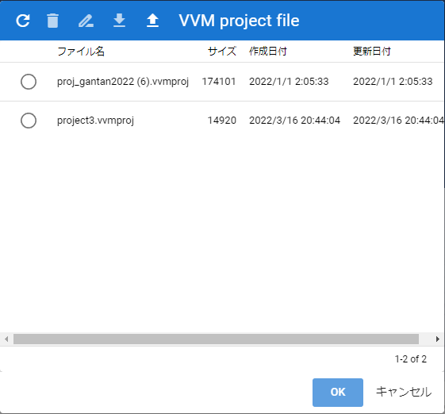

.. index:: 内部ストレージダイアログ（画面の構成）

####################################
内部ストレージダイアログ
####################################

|

　アプリ内部に保存したアニメーションプロジェクトや一度開いたことのあるファイルを開くための画面です。

|

**ツールバー：**

:再読み込み:
    一覧を再読み込みします。
:削除:
    選択したファイルを（アプリ内部から）削除します。
:ファイルの種類名:
    現在表示しているファイルの種類名です。

.. note::
    ※以下はアニメーションプロジェクトのみです。
    
    :名前を変更:
        選択したプロジェクトファイルの名前を変更します。
    :ダウンロード:
        選択したアニメーションプロジェクトをダウンロードして保存します。
    :ファイルから開く:
        アニメーションプロジェクトファイルを端末から開きます。

:検索ボックス:
    各ファイルをインクリメンタルサーチする入力欄です。

:一覧:
    ファイル名、サイズ、作成日付、更新日付を表示する一覧です。