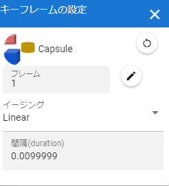

.. index:: キーフレームの設定（画面の構成）

####################################
キーフレームの設定
####################################

|

　タイムライン中のキーフレームに関連する設定ウィンドウです。本ウィンドウはドラッグ可能です。

| 

:ロール名:
    現在編集中のタイムラインのロールの名称を表示しています。

:間隔をリセット:
    編集中のキーフレームに至るまでの間隔（秒）を自動計算された値に戻します。

:フレーム:
    現在編集中のキーフレームの番号を表示しています。ここを変更するとそのフレーム位置にキーフレームの設定が移動します。

:移動ボタン:
    フレーム位置の移動を確定します。すでにキーフレームが登録されているフレーム位置を入力した場合、ボタンは押せなくなります。

:イージング:
    編集中のキーフレームに至るまでのイージングを選択します。

:間隔:
    一つ前の登録済みキーフレームから編集中のキーフレームに至るまでの間隔（秒）を手動で指定します。基本的に自動で計算されますが、あえて変更したい場合にはここで変更できます。

:次のタイムラインの間隔をコピーする:
    コピー元のタイムライン（役割）を選択し、そのタイムラインに登録されたキーフレームの開始と終了を指定することで、その範囲の間隔(duration)の合計値をコピーすることができます。

    **※コピーした後に反映するには、さらに間隔(duration)の入力ボックスを操作する必要があります。**
