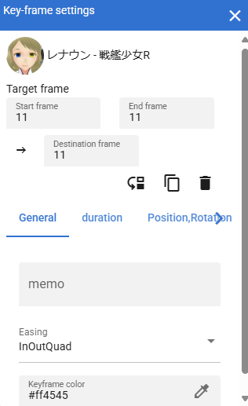

.. index:: キーフレームの設定（画面の構成）

####################################
キーフレームの設定
####################################

.. |keyframe2| image:: ../img/screen_keyframe02.png
.. |keyframe3| image:: ../img/screen_keyframe03.png

　タイムライン中のキーフレームに関連する設定ウィンドウです。本ウィンドウは内部ウィンドウですが、設定により別ウィンドウでも表示できます。

　登録済みキーフレームをダブルクリックすると開きます。

.. csv-table::

    |keyframe1|, |keyframe2|, |keyframe3|

|

:ロール名:
    現在編集中のタイムラインのロールの名称を表示しています。

対象のフレーム
    :開始フレーム、終了フレーム:
        現在編集中のキーフレームの番号を表示しています。タイムラインから選択したときは両方に同じフレーム番号がセットされますが、ここを任意の範囲に変えることができます。

        たとえば開始フレーム＝10、終了フレーム15とした場合、10～15の範囲にある登録済みキーフレームが操作の対象となります。
        
    :移動先フレーム:
        ここを変更するとそのフレーム位置にキーフレームの設定が移動します。ここは移動後の開始フレームに相当します。

    :移動ボタン:
        フレーム位置の移動を確定します。すでにキーフレームが登録されているフレーム位置を入力した場合、ボタンは押せなくなります。

イージングタブ
    :イージング:
        編集中のキーフレームに至るまでのイージングを選択します。

間隔(duration)タブ
    :間隔:
        一つ前の登録済みキーフレームから編集中のキーフレームに至るまでの間隔（秒）を手動で指定します。基本的に自動で計算されますが、あえて変更したい場合にはここで変更できます。

    :間隔をリセット:
        編集中のキーフレームに至るまでの間隔（秒）を自動計算された値に戻します。

    :次のタイムラインの間隔をコピーする:
        コピー元のタイムライン（役割）を選択し、そのタイムラインに登録されたキーフレームの開始と終了を指定することで、その範囲の間隔(duration)の合計値をコピーすることができます。

        **※コピーした後に反映するには、さらに間隔(duration)の入力ボックスを操作する必要があります。**

位置,回転タブ
    :位置X, Y, Z:
        それぞれの座標です。

    :回転X, Y, Z:
        それぞれの軸の回転角度です。プロパティ一覧の同項目と異なり、ここでは -180～+180度までとなります。
