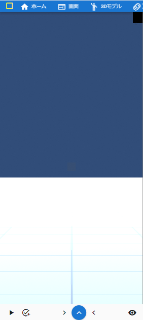
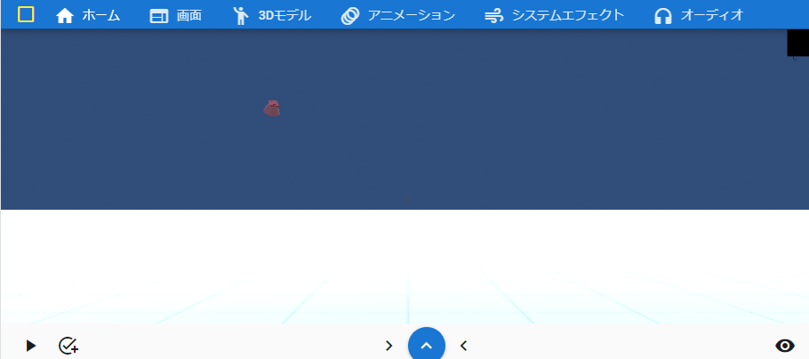

.. index:: メイン画面（画面の構成）

###############
メイン画面
###############

.. contents::

.. _screenmain_normal:

メイン画面
===============

.. image:: ../img/screen_main.png
    :align: center

|

:A リボンバー（タブ）:
    アプリの各機能を呼び出すメニュー。
:B オブジェクト一覧:
    読み込んだVRMやFBX、各オブジェクトの一覧。
:C WebGL:
    VRMなどが実際に表示される画面。WebGLという形式。サイズの変更可能。
:D プロパティ一覧:
    選択したVRMや各オブジェクトの細かいプロパティ変更の一覧。
:E タイムライン:
    アニメーション用のタイムライン。登録したキーフレームがここに表示される。

.. note::
    * WebGL画面には、設定によりメインカメラの中心点が表示されます。
    * B、Dはそれぞれの右端のボタンで最小化することができます。（その分CのWebGLが拡大縮小します）

.. _screenmain_mobile:

モバイル表示
-------------------

[URL]/mui でこの表示モードで使用することができます。

スマートフォンなどの画面が狭いモバイル端末ではこれらのような表示になります。左右やタイムラインパネルは初期状態では非表示です。

:この表示モードが適しているデバイス: スマートフォン, タブレット, ファブレット(例: Galaxy Fold など)

.. csv-table::
    :header-rows: 1

    ポートレート, ランドスケープ
    |mblport|, |mblland|

:画面下部:
    左から次の順にボタンが並んでいます。もっともよく使いそうな機能のボタンです。

    .. csv-table::

        アニメーション再生・一時停止, キーフレーム登録, オブジェクト一覧パネル表示, タイムラインパネル表示(青いボタン) , プロパティパネル表示, V-padパネル表示

アプリのウィンドウとサブウィンドウ
========================================

　本アプリではこのメイン画面を示すウィンドウと、後述のいくつかのサブウィンドウで構成されています。

.. csv-table::
    :header-rows: 1

    ウィンドウ名, ウィンドウの種類(ウェブアプリ版), ウィンドウの種類(各OS版),ウィンドウの種類(モバイル表示)
    メインウィンドウ, ブラウザタブまたは別ウィンドウ, 別ウィンドウ, ブラウザタブ
    スクリーンショット, 別ウィンドウ, 別ウィンドウ, 別タブ
    ポーズ一覧, 別ウィンドウ, 別ウィンドウ, 別タブ
    IKマーカーの一括変更, 別ウィンドウ, 別ウィンドウ,別タブ
    重力設定, アプリ内ウィンドウ, アプリ内ウィンドウ, アプリ内ウィンドウ
    ポーズトラッキング, 別ウィンドウ, 別ウィンドウ, 別タブ
    ビデオプレイヤー, 別ウィンドウ, 別ウィンドウ, 別タブ
    キーフレームの設定, 別ウィンドウまたはアプリ内ウィンドウ, 別ウィンドウまたはアプリ内ウィンドウ, 別タブまたはアプリ内ウィンドウ
    内部ストレージダイアログ, アプリ内ウィンドウ, アプリ内ウィンドウ, アプリ内ウィンドウ
    ナビゲーション, アプリ内ウィンドウ, アプリ内ウィンドウ, アプリ内ウィンドウ

　別ウィンドウの場合、メインウィンドウ（またはタブ）を閉じるとその時開いているサブウィンドウらも全て閉じます。
