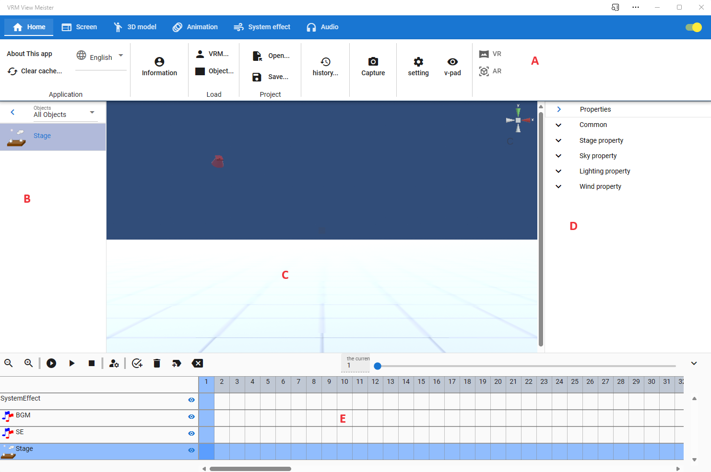

.. index:: メイン画面（画面の構成）

###############
メイン画面
###############

|

:A リボンバー（タブ）:
    アプリの各機能を呼び出すメニュー。
:B オブジェクト一覧:
    読み込んだVRMやFBX、各オブジェクトの一覧。
:C WebGL:
    VRMなどが実際に表示される画面。WebGLという形式。サイズの変更可能。
:D プロパティ一覧:
    選択したVRMや各オブジェクトの細かいプロパティ変更の一覧。
:E タイムライン:
    アニメーション用のタイムライン。登録したキーフレームがここに表示される。

.. note::
    * WebGL画面には、設定によりメインカメラの中心点が表示されます。
    * B、Dはそれぞれの右端のボタンで最小化することができます。（その分CのWebGLが拡大縮小します）

アプリのウィンドウとサブウィンドウ
========================================

　本アプリではこのメイン画面を示すウィンドウと、後述のいくつかのサブウィンドウで構成されています。

.. csv-table::
    :header-rows: 1

    ウィンドウ名, ウィンドウの種類(ウェブアプリ版), ウィンドウの種類(各OS版)
    メインウィンドウ, ブラウザタブまたは別ウィンドウ, 別ウィンドウ
    スクリーンショット, 別ウィンドウ, 別ウィンドウ
    ポーズ一覧, 別ウィンドウ, 別ウィンドウ
    IKマーカーの一括変更, 別ウィンドウ, 別ウィンドウ
    重力設定, アプリ内ウィンドウ, アプリ内ウィンドウ
    ポーズトラッキング, 別ウィンドウ, 別ウィンドウ
    ビデオプレイヤー, 別ウィンドウ, 別ウィンドウ
    キーフレームの設定, 別ウィンドウまたはアプリ内ウィンドウ, 別ウィンドウまたはアプリ内ウィンドウ
    内部ストレージダイアログ, アプリ内ウィンドウ, アプリ内ウィンドウ
    ナビゲーション, アプリ内ウィンドウ, アプリ内ウィンドウ

　別ウィンドウの場合、メインウィンドウ（またはタブ）を閉じるとその時開いているサブウィンドウらも全て閉じます。
