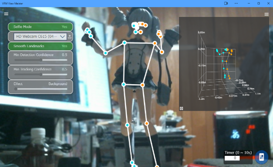

.. index:: ポーズトラッキング画面（画面の構成）
.. index:: MediaPipe（画面の構成）

####################################
ポーズトラッキング画面
####################################

|

　GoogleのMediaPipeというライブラリによるポーズのリアルタイム取得画面です。このウィンドウはアプリとは別ウィンドウです。

**右上：**

ポーズ検出のための各機能のメニューです。

:Selfie Mode(セルフィーモード):
    映像が反転します。
:コンボボックス:
    | カメラを選択します。
    | ボックスの **横のアイコン** をクリックすると画像ファイルを開くことができます。
:Smooth Landmarks(プレビューのスムーズ化):
    右上の全体のプレビューの精度を調整します。
:Min Detection Confidence(ポーズ検出の正確さ):
    ポーズの検出の精度を高めます。
:Min Tracking Confidence(トラッキングの正確さ):
    トラッキングの精度を高めます。
:Effect(エフェクト):
    （MediaPipeのサイトを参照してください）

**右上（背景）：**

メニューを隠すと背景にトラッキング結果のプレビューを見ることができます。

:全体のプレビュー:
    トラッキング結果のプレビューです。ドラッグして任意の方向を確認できます。左下の || ボタンでプレビューの回転を固定することができます。

**右下：**

:タイマー:
    この指定秒数後に自動的に撮影します。
:ポーズ保存:
    このボタンを押した瞬間の検出ポーズをデータに保存します。タイマーの秒数が0以外の場合はタイマーが起動します。

.. note::
    メニューパネルは ＝ボタンで非表示に出来ます。