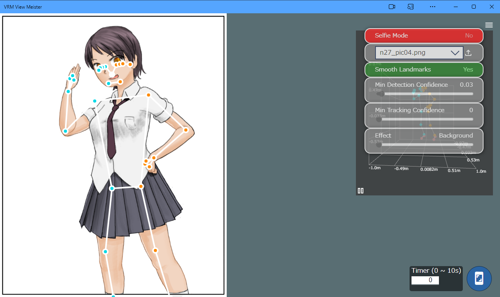

####################################
ポーズトラッキング画面
####################################

|

　GoogleのMediaPipeというライブラリによるポーズのリアルタイム取得画面です。操作用のダイアログはドラッグ可能です。アプリとは別ウィンドウです。

**左上：**

| セルフィーモード・・・映像が反転します。
| コンボボックス・・・カメラを選択します。ボックスの横のアイコンをクリックすると画像ファイルを開くことができます。
| プレビューのスムーズ化・・・右上の全体のプレビューの精度を調整します。
| ポーズ検出の正確さ・・・ポーズの検出の精度を高めます。
| トラッキングの正確さ・・・トラッキングの精度を高めます。
| エフェクト・・・（MediaPipeのサイトを参照してください）

**右上：**

全体のプレビュー・・・トラッキング結果のプレビューです。ドラッグして任意の方向を確認できます。左下の || ボタンでプレビューの回転を固定することができます。

**右下：**

| タイマー・・・この指定秒数後に自動的に撮影します。
| ポーズ保存・・・このボタンを押した瞬間の検出ポーズをデータに保存します。タイマーの秒数が0以外の場合はタイマーが起動します。

.. note::
    左上と右上のパネルは ＝ボタンで非表示に出来ます。