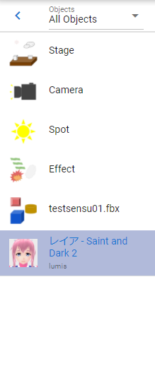
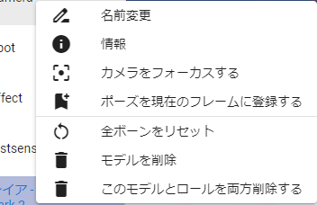
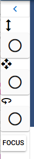
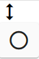
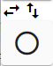
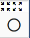

.. index:: オブジェクト一覧（画面の構成）

####################################
オブジェクト一覧
####################################

.. contents::

　WebGL画面の左にある一覧です。読み込んだ各オブジェクトがここにまとまって表示されます。

      
上部
#################

:矢印ボタン:
    押すとオブジェクト一覧を折りたたんで細くすることができます。
:コンボボックス:
    オブジェクトの種類を選択します。下の一覧がその種類のオブジェクトのみ表示されます。

.. note::
    一定のサイズ以下の画面解像度のモバイル端末では、オブジェクト一覧はオーバーレイ形式で表示されます。

    つまり、なにか操作をするとパネルが自動的に折りたたまれます。

下部
#########################

:一覧:
    オブジェクト一覧です。ここに表示されるのは次の種類です。

``VRM``、 ``他3Dオブジェクト``、 ``カメラ``、 ``エフェクト``、 ``ライト``、 ``画像``、 ``テキスト``、 ``UI画像``、 ``ステージ``

.. note::
    * システムエフェクト、オーディオはここには表示されません。
    * 選択したオブジェクトが割り当てられているロールのタイムラインも自動的に選択されます。
    * 名称が長い場合、末尾は省略されます。その代わりマウスカーソルを当てるとフル名称がツールチップとして表示されます。

|

右クリックメニュー
##########################

　オブジェクト一覧で右クリックするとそのオブジェクトに対する個別の操作を行えます。

| 

:名前変更:
    オブジェクトの表示名を変更します。
:情報:
    VRoid/VRMのみ情報画面を表示します。
:カメラをフォーカスする:
    このオブジェクトが画面の中心に映るようメインカメラを移動します。
:ポーズを現在のフレームに登録する:
    アニメーションプロジェクトで使用します。現在のポーズを現在のキーフレームに登録します。
:全ボーンをリセット:
    ポーズをリセットしてTポーズ（デフォルト）に戻します。
:モーションファイルを読み込む:
    プロジェクト設定の ``モーションファイルを読み込む`` と同じです。現在選択中のオブジェクトに対してモーションファイルを読み込んで適用します。
:モデルを削除:
    オブジェクトをアプリから削除します。
:このモデルとロールを両方削除する:
    オブジェクトとそれに紐づくロール（役割）をアプリから削除します。

.. _leftpanelclosing:

V-pad（左）
############################

　ver 2.7.0より導入しました。パネルを折りたたんだときに、v-padと同等の機能を利用することができます。

.. hint::
    主にモバイル端末の操作に効果的です。

.. caution::
    モバイル表示(/mui)モード時には表示されません。

|

.. csv-table::

    |vpprogress|, 上下にスワイプ（ドラッグアンドドロップ）することで、メインカメラを前進・後進します。マウスのホイールの操作に相当します。
    |vpmove|, 上下にスワイプ（ドラッグアンドドロップ）することでメインカメラが上昇・下降します。左右にスワイプして左右に移動します。[1]_
    |vpcamera|, メインカメラと回転の中心のオブジェクトを近づけたり離したりします。

.. [1] スマートフォンで操作する場合、画面端からのスワイプはOSの機能である ``戻る`` や ``進む`` に割り当てられていることがあります。画面端からスワイプせず、なるべくこの四角いパネルの中心からスワイプするようにしてみてください。

.. admonition:: 移動と回転のスピードについて

    アプリケーションの設定の ``アプリケーション`` タブにあるV-padの ``移動速度`` 、 ``回転速度`` でスピードを調整することができます。
