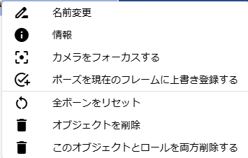

.. index:: オブジェクト一覧（画面の構成）

####################################
オブジェクト一覧
####################################

　WebGL画面の左にある一覧です。読み込んだ各オブジェクトがここにまとまって表示されます。

**上部：**

:矢印ボタン:
    押すとオブジェクト一覧を折りたたんで細くすることができます。
:コンボボックス:
    オブジェクトの種類を選択します。下の一覧がその種類のオブジェクトのみ表示されます。

**下部：**

:一覧:
    オブジェクト一覧です。ここに表示されるのは次の種類です。

``VRM``、 ``他3Dオブジェクト``、 ``カメラ``、 ``エフェクト``、 ``ライト``、 ``画像``、 ``テキスト``、 ``UI画像``、 ``ステージ``

.. note::
    * システムエフェクト、オーディオはここには表示されません。
    * 選択したオブジェクトが割り当てられているロールのタイムラインも自動的に選択されます。
    * 名称が長い場合、末尾は省略されます。その代わりマウスカーソルを当てるとフル名称がツールチップとして表示されます。

|

**右クリックメニュー**

　オブジェクト一覧で右クリックするとそのオブジェクトに対する個別の操作を行えます。

| 

:名前変更:
    オブジェクトの表示名を変更します。
:情報:
    VRoid/VRMのみ情報画面を表示します。
:カメラをフォーカスする:
    このオブジェクトが画面の中心に映るようメインカメラを移動します。
:ポーズを現在のフレームに登録する:
    アニメーションプロジェクトで使用します。現在のポーズを現在のキーフレームに登録します。
:全ボーンをリセット:
    ポーズをリセットしてTポーズ（デフォルト）に戻します。
:モーションファイルを読み込む:
    プロジェクト設定の ``モーションファイルを読み込む`` と同じです。現在選択中のオブジェクトに対してモーションファイルを読み込んで適用します。
:モデルを削除:
    オブジェクトをアプリから削除します。
:このモデルとロールを両方削除する:
    オブジェクトとそれに紐づくロール（役割）をアプリから削除します。

