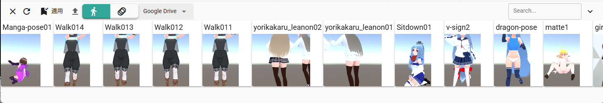
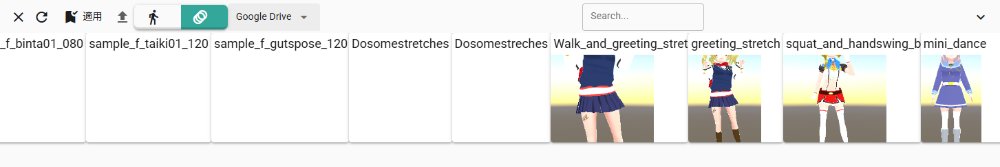

.. index:: ポーズ・モーション一覧（画面の構成）

####################################
ポーズ・モーション一覧
####################################

.. |posewin1| image:: ../img/screen_pose.png
.. |posewin2| image:: ../img/screen_pose2.png

.. csv-table::

    ダイアログ(ポーズ), ダイアログ(モーション)
    |posewin1|, |posewin2|

ver 2.18.0より、メインウィンドウ下部のタイムラインパネルと同じ位置に表示できるようになりました。

.. csv-table::

    パネル(ポーズ)
    |posewin3|
    パネル(モーション)
    |posewin4|
    

|

　ポーズ一覧は ver 2.3.0 より モーションの管理にも対応しました。別ウィンドウが開きます。アプリとは別ウィンドウです。

ver 2.9.0より、設定によりアプリのメインウィンドウ内部に表示することもできるようになりました。

* ポーズはVRoid/VRMの単一のポーズを保存しておくことができます。
* モーションはすべてのオブジェクト（キャスト）の種類を読み込むことができます。

|

ツールバー
    :閉じる:
        パネル表示時、閉じてタイムラインパネルに戻す。
    :再読み込み:
        ポーズ一覧を再読み込みする。
    :ポーズを適用:
        現在選択中のポーズを現在選択中のVRoid/VRMに反映する。ポーズ・モーションをダブルクリック（ダブルタップ）でも適用できます。
    :ポーズを削除:
        現在選択中のポーズを削除する。

        * パネル表示時は任意のポーズ・モーションを右クリックで表示されるメニューから選べます。
        * アプリ上からの削除は現在のところ内部ストレージのものしか削除できません。
    :ファイルとしてダウンロード:
        現在選択中のポーズをファイルにダウンロードする。
        パネル表示時は任意のポーズ・モーションを右クリックで表示されるメニューから選べます。
    :ファイルから開く:
        端末からポーズファイルを開く。

タブ
    :Pose: 一覧をポーズに切り替える
    :Motion: 一覧をモーションに切り替える

コンボボックス
    :読み込み場所:
        Internal Storage, Google Drive, Applicationのいずれかから選択します。

        ================== ================
        種類                意味
        ================== ================
        Internal Storage   内部ストレージ
        Google Drive       Googleドライブ
        Application        アプリケーション（つまりプリセットのサンプル）
        ================== ================

下部
    ポーズ・モーション一覧:
        保存したポーズやモーションを表示します。
        
        ポーズはサムネイル付きです。サムネイルの横にはポーズ名と保存時のアバター（VRM）名を合わせて表示します。

        モーションは対応するオブジェクトの種類、フォーマットのバージョン、キーフレーム数、開始フレーム、終了フレームを表示します。

|

.. hint::
    ウィンドウのサイズに応じて2列・3列と多段表示になります。

