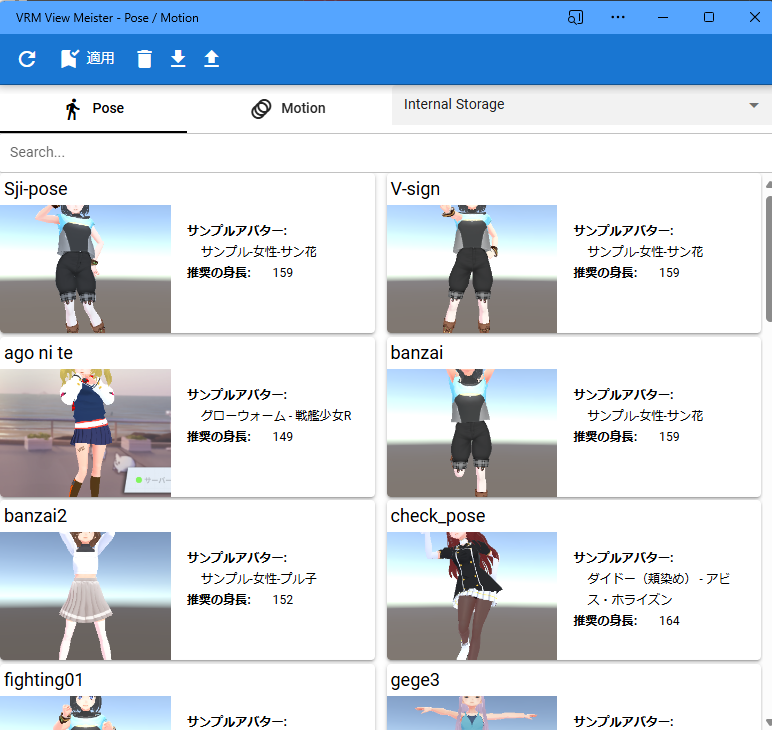

.. index:: ポーズ・モーション一覧（画面の構成）

####################################
ポーズ・モーション一覧
####################################

.. |posewin2| image:: ../img/screen_pose2.png

.. csv-table::

    |posewin1|, |posewin2|

|

　ポーズ一覧は ver 2.3.0 より モーションの管理にも対応しました。別ウィンドウが開きます。アプリとは別ウィンドウです。

* ポーズはVRoid/VRMの単一のポーズを保存しておくことができます。
* モーションはすべてのオブジェクト（キャスト）の種類を読み込むことができます。

|

**上部：**

:再読み込み:
    ポーズ一覧を再読み込みする。
:ポーズを適用:
    現在選択中のポーズを現在選択中のVRoid/VRMに反映する。
:ポーズを削除:
    現在選択中のポーズを削除する。
:ファイルとしてダウンロード:
    現在選択中のポーズをファイルにダウンロードする。
:ファイルから開く:
    端末からポーズファイルを開く。
:読み込み場所:
    Internal Storage, Google Drive, Applicationのいずれかから選択します。

    ================== ================
    種類                意味
    ================== ================
    Internal Storage   内部ストレージ
    Google Drive       Googleドライブ
    Application        アプリケーション（つまりプリセットのサンプル）
    ================== ================

:Pose: 一覧をポーズに切り替える
:Motion: 一覧をモーションに切り替える

**下部：**

ポーズ一覧:
    保存したポーズやモーションを表示します。
    
    ポーズはサムネイル付きです。サムネイルの横にはポーズ名と保存時のアバター（VRM）名を合わせて表示します。

    モーションは対応するオブジェクトの種類、フォーマットのバージョン、キーフレーム数、開始フレーム、終了フレームを表示します。

|

.. hint::
    ウィンドウのサイズに応じて2列・3列と多段表示になります。

