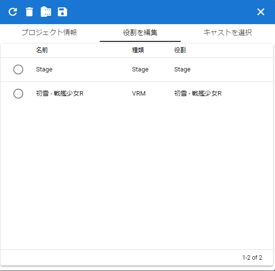

.. index:: プロジェクトの設定（画面の構成）

#######################
プロジェクトの設定画面
#######################

|

　アニメーションにて、各オブジェクトの役割名を設定したり、読み込んだ役割に各オブジェクトを割り当てる画面です。（アニメーションについては後述）

**プロジェクト情報：**

| 名前・・・アニメーションプロジェクトの名称
| 説明・・・アニメーションプロジェクトの詳細説明
| URL・・・明記したいURL
| ライセンス・・・アニメーションプロジェクトのライセンス条項（必要であれば）

**役割を編集：**

| キャスト・・・オブジェクトの名前
| 種類・・・オブジェクトの種類
| 役割・・・オブジェクトの役割（アニメーションプロジェクト内における識別のための名称）を入力

**キャストを選択：**

| 役割・・・アニメーションプロジェクトにおける役割
| 種類・・・役割の種類
| キャスト・・・役割に割り当てるオブジェクトを選択
