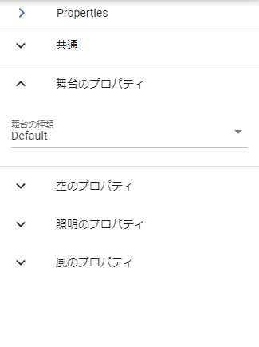

.. index:: プロパティ一覧（画面の構成）

####################################
プロパティ一覧
####################################

　WebGL画面の右にある一覧です。読み込んだ各オブジェクトの設定項目が並びます。

|

:矢印ボタン:
    押すとプロパティ一覧を折りたたんで細くすることができます。

**各アコーディオンパネル：**

オブジェクトの種類により表示されるプロパティは異なります。
