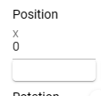

.. index:: プロパティ一覧（画面の構成）

####################################
プロパティ一覧
####################################

.. contents::

.. image:: ../img/screen_prop.png
    :align: center

　WebGL画面の右にある一覧です。読み込んだ各オブジェクトの設定項目が並びます。

|

:矢印ボタン:
    押すとプロパティ一覧を折りたたんで細くすることができます。

.. note::
    一定のサイズ以下の画面解像度のモバイル端末では、プロパティ一覧はオーバーレイ形式で表示されます。

    つまり、なにか操作をするとパネルが自動的に折りたたまれます。

各アコーディオンパネル
#################################

オブジェクトの種類により表示されるプロパティは異なります。

スワイプパネル
===========================

ver 2.7.0より導入しました。上下左右にスワイプすることで数値の入力ボックスの値を増減することができます。入力ボックスの直下にある白いボックスです。

スワイプすると、``+`` や ``-`` が表示されます。

|

:左にスワイプ, 下にスワイプ: 値の減少

:右にスワイプ, 上にスワイプ: 値の増加

.. hint::
    主にモバイル端末での操作に効果的です。

    プロパティ一覧に設置された入力ボックス系のUIは、操作をするために入力フォーカスが当たると、自動的にパネルが折りたたまれてしまいます。そうすると操作したいのにすぐパネルが閉じてしまって操作できなくなるおそれがあります。

    このスワイプパネルを使うことで、モバイル端末でも値を操作することが簡単にできるようになります。

V-pad（右）
############################

　ver 2.7.0より導入しました。パネルを折りたたんだときに、v-padと同等の機能を利用することができます。

機能は :ref:`leftpanelclosing` をご覧ください。
