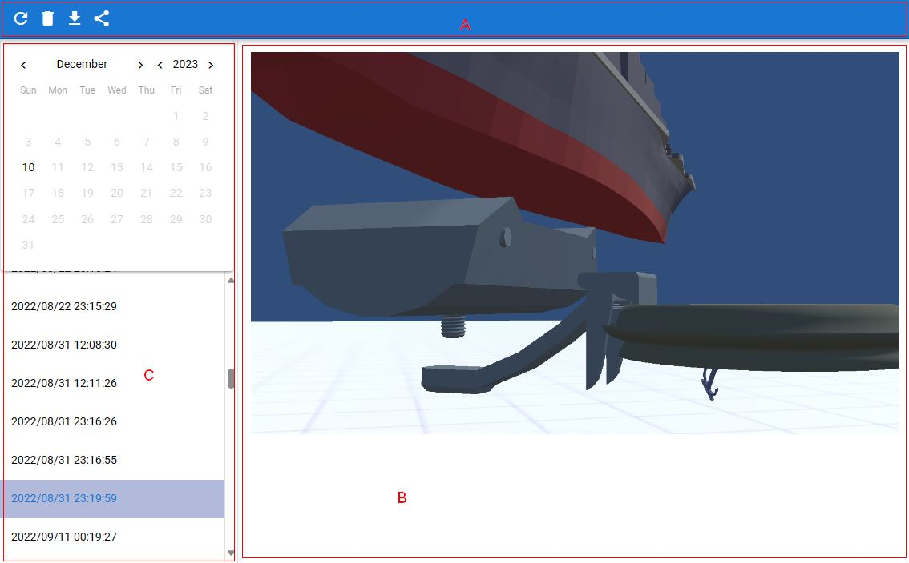

.. index:: スクリーンショット（画面の構成）

####################################
スクリーンショット
####################################

|

　スクリーンショット一覧は現在保存してあるスクリーンショットを確認・ダウンロード・削除を行うウィンドウです。アプリとは別ウィンドウです。

ver 2.9.0より、設定によりアプリのメインウィンドウ内部に表示することもできるようになりました。

:A ツールバー:
    左パネル開閉ボタン、削除ボタン、再読み込みボタン、ダウンロードボタン、共有ボタン、閉じるボタン

    * 閉じるボタンはアプリ内ウィンドウで表示した場合のみ

:B スクリーンショット:
    実際のスクリーンショット。ブラウザの場合は右クリックして保存も可能。
:C カレンダー:
    左パネル内にあります。スクリーンショットを撮影した日付のカレンダー。右のアイコンをクリックするとカレンダーが開きます。
:D スクリーンショット一覧:
    左パネル内にあります。スクリーンショットを撮った日付の一覧。クリックすると画像を表示。

他の画面
#################

モバイル表示、ポートレート
    カレンダーやスクリーンショット一覧は非表示にすることができます。ツールバーの左端のボタンをクリックしてください。

    .. image:: ../img/screen_scrshot_mbl.jpg
        :align: center

