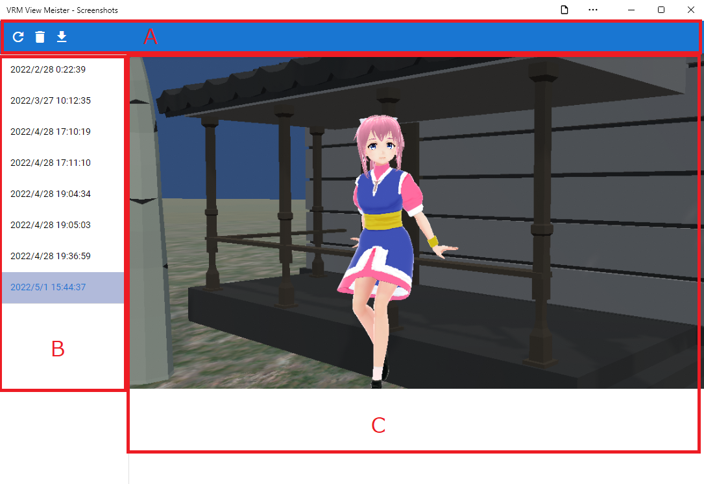

.. index:: スクリーンショット（画面の構成）

####################################
スクリーンショット
####################################

|

　スクリーンショット一覧は現在保存してあるスクリーンショットを確認・ダウンロード・削除を行うウィンドウです。アプリとは別ウィンドウです。

:A ツールバー:
    削除ボタン、再読み込みボタン、ダウンロードボタン
:B 日付一覧:
    スクリーンショットを撮った日付の一覧。クリックすると画像を表示。
:C スクリーンショット:
    実際のスクリーンショット。ブラウザの場合は右クリックして保存も可能。