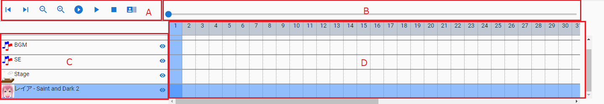
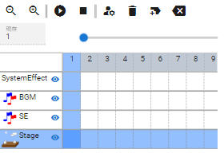
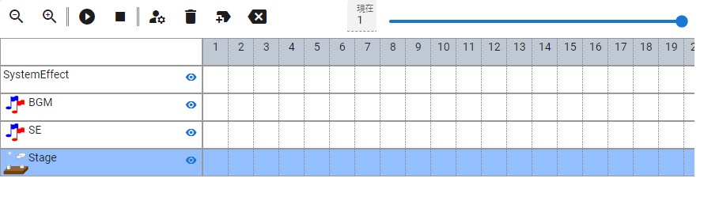

.. index:: タイムライン（画面の構成）

####################################
タイムライン
####################################

.. contents::

|

　WebGL画面の下にある機能です。アニメーションで使われます。

パネル
########################

A ツールバー:
    左から順に次のとおりに並んでいます。
    

    1. ポーズ・モーションパネル (ver 2.18.0より)
    2. 表示を縮小
    3. 表示を拡大
    4. 最初から再生
    5. 再生/一時停止
    6. 停止
    7. フレームを読み込む [1]_
    8. キーフレーム設定ウィンドウ表示
    9. キーフレームを登録
    10. キーフレームを削除
    11. 現在の位置に空のフレームを挿入
    12. 現在のフレーム位置を削除

    .. [1] アプリの設定の「フレームを選択する時、プレビューする」がオフの場合のみ表示されます

B シークバー:
    フレームの現在位置を任意の場所に移動します。

C オブジェクト・ロール名:
    タイムラインを識別するために表示されます。

    表示・非表示ボタン
        オブジェクトをWebGL画面から隠します。

    右クリック
        3D系のオブジェクトのみ右クリックでコンテキストメニューを表示できます。
        
        :情報:
            VRoid/VRMのみ情報画面を表示します。
        :カメラをフォーカスする:
            このオブジェクトが画面の中心に映るようメインカメラを移動します。
        :全ボーンをリセット:
            ポーズをリセットしてTポーズ（デフォルト）に戻します。

D  タイムライン:
    各オブジェクトごとにキーフレームを表示します。上部の番号を押すことで操作するフレームを切り替えできます。登録したキーフレームの箇所には赤く塗りつぶされます。 **子キーを登録するとキーフレームの赤いセル部分の数値がその分カウントされます。**

    ダブルクリックするとキーフレームの設定のウィンドウが開きます。
    
    登録済みのキーフレームにマウスカーソルを当てると現在の設定がポップアップで確認できます。

    .. image:: ../img/screen_timeline02.png
        :align: center
    
    |

    アイコンとその意味は :ref:`inputikasmarker` を御覧ください。

:E  パネル拡大・縮小ボタン:
    タイムラインのパネルを拡大、縮小（ツールバーのみ）を切り替えます。

モバイル表示
=============================

.. csv-table::
    :header-rows: 1

    ポートレート, ランドスケープ
    |mblport|, |mblland|

.. note::
    * モバイル表示の場合、 ``再生/一時停止`` と ``キーフレームを登録`` はメイン画面の最下部のフッターにあります。
    * ポートレートの場合、ツールバーは2行に分割されます。

