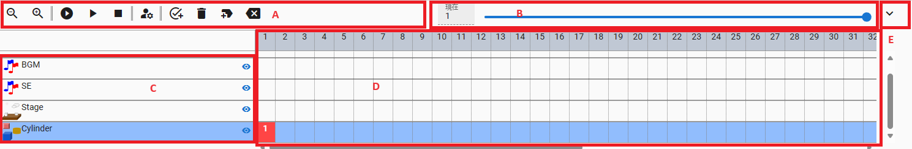

.. index:: タイムライン（画面の構成）

####################################
タイムライン
####################################

|

　WebGL画面の下にある機能です。アニメーションで使われます。

**A ツールバー:**

左から・・・フレームの現在位置を戻す・進める、表示を縮小・表示を拡大、最初から再生、再生/一時停止、停止、フレームを読み込む

**B シークバー**・・・フレームの現在位置を任意の場所に移動します。

**C オブジェクト・ロール名**・・・タイムラインを識別するために表示されます。

| 表示・非表示ボタン・・・オブジェクトをWebGL画面から隠します。
| ロックボタン・・・オブジェクトを編集できないようにします。

**D  タイムライン**・・・各オブジェクトごとにキーフレームを表示します。上部の番号を押すことで操作するフレームを切り替えできます。登録したキーフレームの箇所には赤く塗りつぶされます。