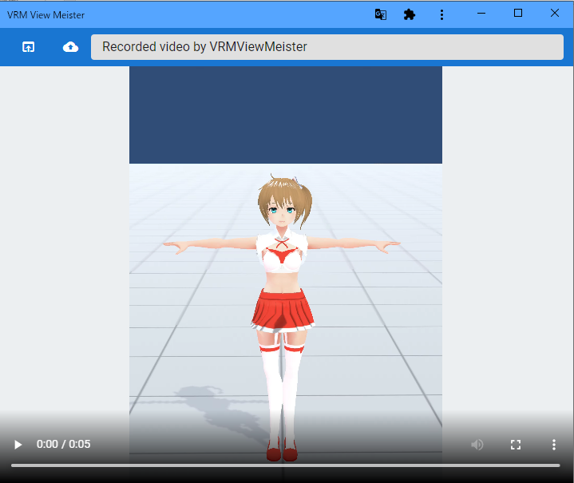

.. index:: ビデオプレイヤー（画面の構成）

####################################
ビデオプレイヤー
####################################

| 

| 　特別な再生アプリを使わないでも本アプリだけでビデオを再生できるよう、専用の簡易ビデオプレイヤーです。アプリとは別ウィンドウです。
| 　また、字幕を編集したり読み込んで字幕付きで再生も可能です。

**上部：**

:アプリから開く:
    本アプリの録画機能で録画したビデオを読み込みます。
:ローカルから開く:
    PC内にあるビデオ（mp4など一般的な形式、webm形式など）を読み込みます。
:字幕の編集:
    読み込んだ動画に合わせて字幕を付与する編集パネルを表示します。

**下部：**

:再生: 動画の最初から再生します。または一時停止します。
:停止: 停止して動画の最初にシークします。

**右側：**

:テキストトラックタブ: 動画に字幕のトラックを追加したり管理できます。
:テキストの編集タブ: 選択した字幕のトラックの中の字幕を編集できます。
:CSSタブ: 字幕のトラックに付与するCSSを編集できます。
