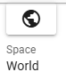

.. index:: v-pad（画面の構成）
.. index:: 仮想操作パッド（画面の構成）

####################################
v-pad（仮想操作パッド）
####################################

.. contents::

V-pad
##############

.. |sub1| image:: ../img/screen_vpad_1.png
.. |sub2| image:: ../img/screen_vpad_2.png
.. |sub3| image:: ../img/screen_vpad_3.png

.. image:: ../img/screen_vpad.png
    :align: center

|

 マウスやVRデバイスのコントローラの代わりにメインカメラの映像を操作できる機能です。四角のパネル内を上下左右にスワイプ（マウスでドラッグ）するとそのとおりにWebGL画面が動きます。操作の長さにより回転量・移動量は決まります。

.. hint::
    ver 2.10.0 より、操作対象を切り替えられるようになりました。
    
    * メインカメラ
    * 選択中のオブジェクト

 次の場合にご活用いただけます。

* キーボードを使わずに片手で操作したい
* タブレットPCでも使いたい

 VRデバイスでもコントローラやハンドトラッキングにより使うことができます。WebGL画面を操作するのに細かい調整ができます。

 合わせて :ref:`vpad_for_vrar` を参照してください。

: |sub4| 移動:
    操作対象を前後、左右に移動します。

: |sub5| 上下:
    操作対象を上や下に移動します。

: |sub6| 回転:
    操作対象を上下左右に回転します。

:|sub1| カメラのZ軸をリセット:
    キーボード操作の ``Q`` キーと同じです。メインカメラのZ軸の回転を初期化します。

カメラをリセット:
    | メインカメラの位置をデフォルトに戻します。（ショートカット：Rキー）
    | ※リボンバーの画面タブにあるボタンと同じです。

: |sub7| 操作対象の切り替え:
    Camera(メインカメラ)、Object(現在選択中のオブジェクト)のいずれかに切り替えます。アイコンが表示されているほうが現在の操作対象です。押すたびに切り替わります。

: |sub8| 操作空間の切り替え:
    操作対象が ``Object`` の場合のみ有効です。移動や回転の空間をWorld(グローバル)、Local(ローカル)に切り替えます。アイコンが表示されているほうが現在の空間です。押すたびに切り替わります。

.. admonition:: 移動と回転のスピードについて

    アプリケーションの設定の ``アプリケーション`` タブにあるV-padの ``移動速度`` 、 ``回転速度`` でスピードを調整することができます。

.. note::
    * 上下のパネルは上下のスワイプ（ドラッグ）のみ可能です。
    * WebGL画面は画面サイズをアップすることができますが、その分マウス操作がしづらくなる恐れがあります。そういう場合にこのv-padを使うと細かく表示を調整できるため便利です。

.. hint::
    ウィンドウ左右にあるオブジェクト一覧、プロパティ一覧のパネルを折りたたむとv-padと同等の機能が使えるスワイプパネルを用意しました。

    機能は :ref:`leftpanelclosing` をご覧ください。

他の画面
#################

:FOCUS: 選択中のオブジェクトにメインカメラをフォーカスします。

オブジェクト一覧パネル・プロパティパネルを折りたたんだ状態
    .. image:: ../img/screen_objlist02.png
        :align: center

モバイル表示
    画面の端に表示されます。 ver 2.10.0よりポートレート・ランドスケープ両方とも同じ形式にしました。

    .. image:: ../img/screen_vpadmobile01.png
        :align: center

    :左: 上下、移動、FOCUS、操作対象の切り替え
    :右: 回転、FOCUS、操作空間の切り替え
