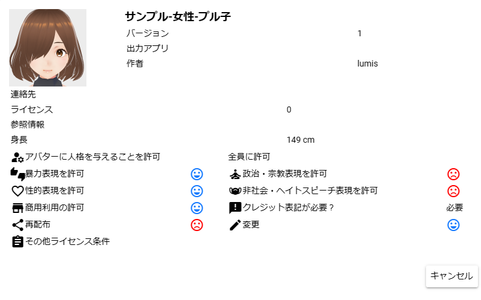

.. index:: VRM情報画面（画面の構成）
.. index:: VRMの利用条件確認画面

####################################
VRM情報画面
####################################

|

　読み込むVRMの利用条件などの各種情報を表示する画面です。初回読み込み時は「利用条件確認画面」となり、OKボタンを押すことでVRMを正式に読み込むことができます。（Cancelボタンを押すと読み込みを中断）

| ※身長はあくまで計算上のもので厳密な値ではありません。
| ※利用条件の許可・不許可は絵文字で表現しています。

.. |sub2| image:: ../img/screen_vrminfo_2.png

|sub1| 許可する

|sub2| 許可しない

.. note::
    ※この画面は初回読み込み以外でもいつでも確認のため表示できます。

