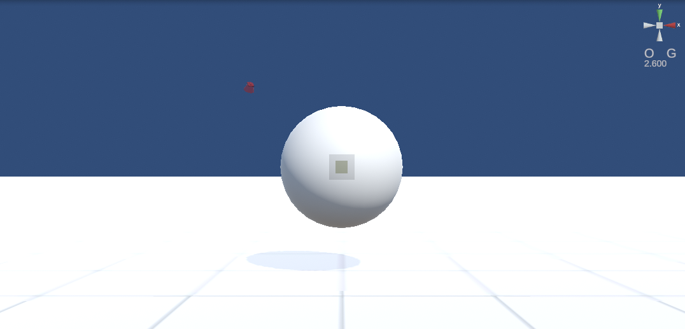

.. index:: WebGL画面（画面の構成）

###############
WebGL画面
###############

:右上:
    
    .. list-table::

        * - 上
          - メインカメラの表示をX軸・Y軸・Z軸の向きの変更
        * - 中
          - | 現在のキーボード操作のモード（C - カメラ、O - オブジェクト）
            | オブジェクトの操作時のグローバル・ローカル基準（G - グローバル、L - ローカル）
        * - 下
          - カメラ前の中心点と選択中のオブジェクトとの距離

:全体:
    VRMやその他オブジェクトが表示される画面。これがメインカメラの映像。

.. index:: 操作方法（画面の構成）

**※操作方法**

:回転:
    マウスの右クリックあるいはCtrlキーを押しながら上下左右に移動
:前進:
    マウスのホイールを動かす。前進あるいは後退となる。
:移動:
    マウスの中クリックあるいはSPACEキーを押しながら上下左右に移動

　マウスジェスチャーのあるブラウザですと操作が競合して正常に動作しない恐れがあります。マウスジェスチャー機能をオフにしていただくか、キーボード操作、あるいは後述のv-padをご利用ください。各OS版は影響ありません。

.. hint::
    　キーボードによる詳しい操作方法は :doc:`../man5/special_operation` をご覧ください。

|

