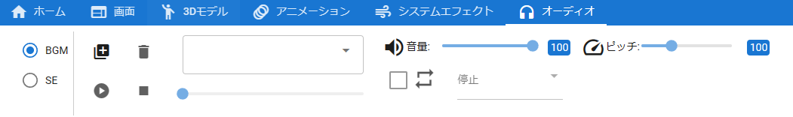
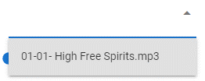

.. index:: Audio

####################################
Audio
####################################

　Audioは3Dオブジェクトではなく、その名の通りオーディオです。Unity標準機能で再生されますが、WebGLの制限で「ogg」は使用不可となっています。

|

　Audioはプロパティ一覧ではなく、上部のリボンバーのオーディオタブで設定を変更します。

1. 次のボタンを押してオーディオファイルを読み込みます。

|

2. 直下のコンボボックスで再生したいオーディオ名を選択します。

|

3. プレビュー再生あるいはアニメーションプロジェクト用に設定します。

.. csv-table::

    プレビュー再生, アニメーション登録用
    |norange|,  |isrange|
    即座に再生されます。こちらの操作はキーフレームには登録されません。, 「再生」や「停止」を選択後にキーフレームに登録します。

4. オーディオをアニメーションプロジェクトに登録するにはタブ内の ``キーフレーム登録`` ボタンか、このタブ内で右クリックし、「キーフレーム登録」ボタンを使用します。

.. image:: ../img/screen_ribbon_animation_keyframe2.png
    :align: center

|

.. note::
    ※このタブ内で右クリックした場合に表示される「キーフレーム登録」はオーディオ専用です。どのオブジェクトを選択していても、必ずオーディオだけを対象にしますので、お間違えないようご注意ください。

.. warning::
    ※オーディオファイルは権利関係が特に厳しいと思われますので、第三者の音楽ファイルを使用する場合は必ず権利関係を守って使用してください。

    　本アプリでは読み込んだオーディオはアプリを再読み込みするとブラウザ上からは削除されます。ローカルでしか扱われず共有機能もないので使用者自身が所持しているファイルしか使えないようになっています。
