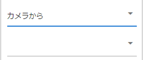

.. index:: Camera

####################################
Camera
####################################

　カメラオブジェクトはシステム上最初から見えている映像であるメインカメラとは別に、サブカメラとして追加できます。
IKマーカーは他と判別しやすくするために実際のカメラ風です。

　カメラの表示の優先度を表す深度は次のようになっています。

.. csv-table::

    システムのメインカメラ,    10
    カメラオブジェクト,       11～n

|
|

　カメラオブジェクトはシステムのメインカメラより必ず上に描画されるようになっています。カメラの追加数に制限はありません。（ビューポートやレンダーテクスチャを使わない限り一度に映すことのできるカメラは一つです）

　プレビューするとそのカメラの映像に切り替わります。あくまでプレビューとしての意味合いなのでメインカメラから見たIKマーカーはそのまま表示されます。

　後述のアニメーションプロジェクトにてカメラオブジェクトからの映像に切り替えるには、すぐ上のコンボボックス「カメラの状態（登録用）」で目的のキーフレーム時に切り替えて登録してください。

.. note::
    ※キーフレームのプレビュー時（キーフレームを選択した時）にはその状態の動作が反映されるので確認できます。（その時にプレビューボタンを押して映像をオフにしても、キーフレームへの登録には変更ありません）

.. index:: レンダーテクスチャ

レンダーテクスチャ
--------------------

　カメラオブジェクトでレンダーテクスチャをONにして有効にしたら、投影したいOtherObjectのプロパティで設定を継続してください。
※プレビューも合わせて有効にしてください。

**OtherObject側**

　OtherObjectではテクスチャの設定を開きます。

　メインのテクスチャで ``カメラから`` を選択し、対象のカメラオブジェクトを選択します。

|
|
|

※平面オブジェクト ``Quad`` と球オブジェクト ``Sphere`` に投影した例。同じカメラオブジェクトを指定すれば同時に複数のオブジェクトに投影することができます。

.. image:: ../img/operation_camera_3.png
    :align: center

