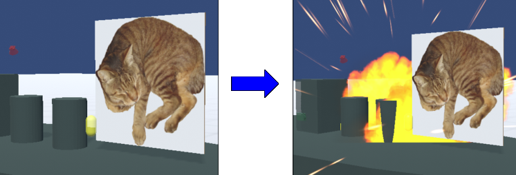
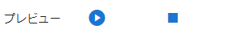
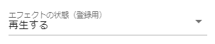
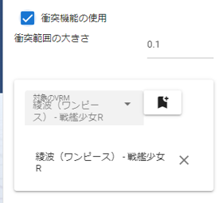
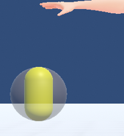
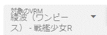
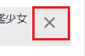

.. index:: Effect

####################################
Effect
####################################

　Effectはアニメーションする画面効果をオブジェクトとして追加したり、他のオブジェクトに対して影響を与える効果を設定することができます。

.. contents::

.. index:: Effectのプレビュー

|

　IKマーカーは他と区別するためにカプセル状になっています。IKマーカーの位置を基準として特殊効果を表示します。同時に表示させる数に制限はありません（ただし動作は重くなる可能性があります）。また、効果音があるエフェクトは同時に音が鳴ります。

　アニメーションプロジェクトではエフェクトのアニメーションの「再生」「停止」などの状態をキーフレームに登録します。

1. ジャンルを選択します。
2. ジャンルに含まれるエフェクト名を選択します。
3. プレビュー再生を押してエフェクトを確認してください。

.. csv-table::

    プレビュー再生, アニメーション登録用
    |preview|, |anireg|
    即座に再生されます。こちらの操作はキーフレームには登録されません。, 「再生」や「停止」を選択後にキーフレームに登録します。

.. caution::
    エフェクトの再生が終わっていないうちは再び再生を行うことはできません。

|

.. index:: VRMとの衝突プロパティ

VRMとの衝突プロパティ
------------------------

　VRMの髪などボーンがある部位に対して衝突させて反動で動かすことのできる効果です。

|

　衝突機能を使用にチェックを入れると衝突の範囲が半透明な球体で描写されます。これはプレビューの意味合いです。

　衝突範囲の大きさで範囲を変更できます。それに合わせてプレビューの球体も変化します。

.. |norange| image:: ../img/operation_effect_5.png

========== ============
|norange|   |isrange|
========== ============

:|collidertarget|:
    |
    | 衝突させたいVRMを選びます。

:|colliderdecide|:
    |
    | 選んだVRMに登録します。一つのEffectに複数のVRMを登録可能です。

:|colliderdelete|:
    |
    | 設定を削除したい場合は対象のVRMの右端のボタンで削除します。

.. index::
    VRM 1.0の仕様による機能の変更(VRMとの衝突プロパティ - Effect)

.. admonition:: VRM 1.0の仕様による機能の変更

    VRM 1.0では髪の毛や胸などのSpringBone周りの仕様が大幅に変更になりました。

    UniVRM 0.xでは何もしなくても常時コライダーとの衝突が有効だったようで、本アプリにおいてもこのEffectオブジェクトをVRMに衝突させたら適切な衝突の激しさでSpringBoneが動きました。

    しかしVRM 1.0では、最初から設定されている身体の部位以外によってSpringBoneを動かすには、特殊な設定が必要になりました。その結果、SpringBoneの動きは 0.x の頃とまったく同じではなくなります。

.. caution::
    **VRMとの衝突プロパティを有効にするのは必要最低限にしてください**

    本プロパティを有効にし、対象のVRMを設定してから身体のボーンを動かすとわかりますが、本プロパティがオフのときよりも髪の毛や胸などのSpringBoneの動きが **非常に緩やか** または **動きが極小** になります。
    
    本来なら機敏に揺れなければいけないのが不自然な動きになるため、Effectオブジェクトの本プロパティによって明示的に特定のVRMのSpringBoneを動かしたい以外では、 **オフにしておくことをオススメ** します。

    VRM 1.0の仕様が変わった際にはまた機能を調整する予定です。

