####################################
オブジェクト操作の基本
####################################

.. contents::

.. index:: オブジェクトを開く

オブジェクトを開く
====================

1. リボンバーのホームタブあるいは3Dモデルタブから各ボタンを押してください。

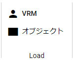
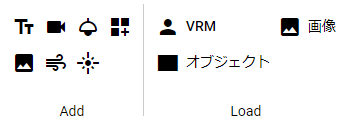

==============  ===================
ホームタブ          3Dモデルタブ
--------------  -------------------
|ribbon_home|   |ribbon_model|
==============  ===================

VRMの場合
    　読み込み後、利用条件確認画面（VRM情報画面）が表示されます。そこで許可をしないと本当には読み込まれません。

OtherObjectの場合
    　一般的なFbxやobjなどを開く際、そのままをファイルダイアログで指定しても開くことができますが、テクスチャなど必要なファイルが複数存在することがあります。

    　本アプリでは利用ライブラリの効果により、たとえばzipファイルのままでも読み込むことが可能です。

    例：
    .obj、.mtl、.png等をまとめて1つのzipファイルにする

    そうして作成したzipファイルを本アプリで読み込むことで正常にテクスチャ等がついた状態で読み込むことができます。

    .. warning::
        3Dモデルファイルであらかじめ適切にテクスチャの設定がされている必要があります。

それ以外
    　読み込み後、すぐに表示されます。

.. note::
    | ※エクスプローラーやファイラーから目的のVRMファイルをWebGL画面へとドラッグアンドドロップして開くこともできます。
    | ※設定「開いたファイルを履歴に保存する」により、一度開いた各オブジェクトは履歴が残るようになります。

|

.. index:: 基本の図形

シンプルな形のオブジェクト
==============================

　OtherObject扱いになる、基本的な形のオブジェクトを追加することができます。

1. リボンバーの3Dモデルタブから「基本の図形」をクリックします。

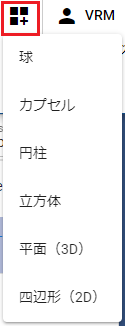

|

※基本の図形は次の種類を開くことができます。

::

    球、カプセル、円柱、立方体、平面（3D）、四辺形（2D）、水面

.. admonition:: 特殊な水面オブジェクト

    水面オブジェクトは常に波がアニメーションして動き続ける特殊なオブジェクトです。

    .. image:: ../img/operation_initial_6.png
        :align: center

    |

    テクスチャのプロパティも非常に多いですが、その分細かく設定すれば水面・海面だけでなく他の用途でも表現できるでしょう。うまく活用してください。

.. hint::
    基本の図形のテクスチャのプロパティで **Cutout** シェーダーを使うと、VR/AR空間で現実の壁や物に合わせて3Dモデルを配置して演出できるようになります。MetaQuest3などの標準の設定にあるような現実を認識しているかのような効果を簡単に付けられます。

    詳しくは :ref:`real_object` を参照してください。

|

.. index:: 
    履歴から開く
    履歴を絞り込む

履歴から開く
======================

　VRM・OtherObject、画像（UI画像含む）は一度開くとアプリ内に履歴が保存されます。次回起動時にはわざわざダイアログをたどったりドラッグしなくても、アプリ内で履歴から開くことができます。

1. リボンバーの「ホーム」タブにあるHistoryをクリックし、対象のオブジェクトの種類を選びます。

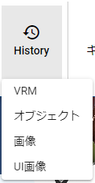

2. 内部ストレージダイアログが開くので対象のオブジェクトを選び、開きます。

.. hint::
    履歴から開く際は一覧上部の検索ボックスに入力すると、対象のファイルを絞り込むことができます。

     .. image:: ../img/operation_initial_7.png
        :align: center

.. note::
    各OS版の場合、オブジェクトファイル自体ではなくファイルパスが履歴として保存されます。そのため実際のファイルを移動したり削除すると、本アプリからも開けなくなります。

.. index:: 履歴を削除する

履歴を削除する
=====================

　貯まりすぎた履歴を削除できます。

**個別に削除する**

1. 削除したいオブジェクトにチェックを入れます。
2. 内部ストレージダイアログの上部にある |histdelbtn| をクリックします。

|

**すべて削除する**

1. リボンバーのホームタブにある ``設定`` を押します。
2. ファイルタブにある ``Clear`` を押してください。

|

.. index::
    サンプルデータ(VRM)
    サンプルデータ(OtherObject)
    サンプルデータ(Image)

アプリのサンプルデータを開く
========================================

リボンバーの ``VRM`` , ``OtherObject`` , ``Image`` では、端末やGoogleドライブからの他、アプリのサーバに保存しているサンプルデータを開くことも出来ます。

サンプルデータは随時追加予定です。

それぞれ、ストレージダイアログが開いて一覧で選ぶことができます。

.. index:: オブジェクトの選択

オブジェクトの選択
============================

　全ての3Dオブジェクトは操作可能な状態になるとIKマーカーが表示されます。操作可能な状態にするには、オブジェクト一覧で選択してください。（TextとUImageは選択してもIKマーカーは表示されません）

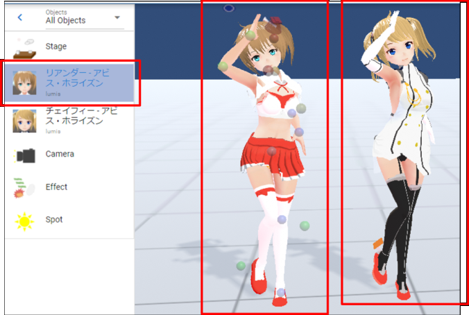

| 

※該当のオブジェクトが操作可能になるとIKマーカーがこのように表示されます。（それ以外のオブジェクトのIKマーカーは非表示になります。

.. warning::
    VRoid/VRMに装着中のオブジェクトは選択してもIKマーカーは表示されません。再び操作可能にするには装着を解除してください。

|

.. index:: オブジェクトの削除

オブジェクトの削除
==========================

オブジェクトを削除するには、オブジェクト一覧で右クリックして「オブジェクトを削除」をクリックします。

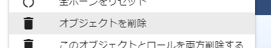

|

.. note::
    この方法ではアニメーションプロジェクトのタイムライン（ロール）を削除することはできません。オブジェクトとタイムライン（ロール）両方を削除する場合は :doc:`../man4/animation_proper` を参照してください。

|

.. index:: オブジェクトの名前変更

オブジェクトの名前変更
=================================

オブジェクトの名前を変更することができます。これは後述のタイムライン（ロール）の名称とは別で、オブジェクト自体の名前・タイトルのことです。

1. オブジェクト一覧で対象を右クリックし、「名前変更」をクリックします。
2. 入力ダイアログで入力し、OKボタンを押して決定します。

|

.. index:: カメラをフォーカスする

カメラをフォーカスする
===============================

対象のオブジェクトがなるべくメインカメラに収まるようカメラの位置・回転を調整します。

1. オブジェクト一覧で対象を右クリックし、「カメラをフォーカスする」をクリックします。

.. index:: このオブジェクトとロールを両方削除する

このオブジェクトとロールを両方削除する
==============================================

オブジェクトの削除とは異なり、オブジェクト自体とロール（タイムライン）の両方を削除します。

キーフレームを登録したタイムライン（ロール）を消したくないなど、よほど特別な理由がない限りは ``このオブジェクトとロールを両方削除する`` で削除することをオススメします。

1. オブジェクト一覧で対象を右クリックし、「このオブジェクトとロールを両方削除する」をクリックします。

|

.. index::
    オブジェクトの移動
    オブジェクトの回転
    オブジェクトの倍率

オブジェクトの移動と回転・倍率変更
============================================

全てのオブジェクトは共通プロパティが使用可能です。ここでは 移動・回転・倍率を行うことができます。

.. |prop3d| image:: ../img/prop_common_1.png
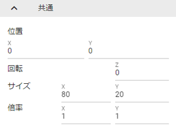

.. csv-table::
    :align: center

    3Dオブジェクト, 2Dオブジェクト
    |prop3d|, |prop2d|

|

.. index::
    移動・回転・倍率
    キーボードによる操作

3Dオブジェクト
---------------------

    3DオブジェクトはそれぞれX, Y, Z 軸で操作をします。ここでの移動・回転はオブジェクト自体となります。(VRMは体の各部位のIKは対象外です)

    同様の操作方法として、IKマーカーをクリックして表示される操作ハンドルもあります。

    キーボード操作にも対応しています。詳しい操作方法は :doc:`../man5/special_operation` をご覧ください。

    .. warning::
        キーボード操作できるオブジェクトの種類は3Dオブジェクトのみです。 ``Text`` と ``UImage`` はキーボード操作 **対象外** です。

|

    .. index:: 360度回転（3Dオブジェクトの操作）

    360度回転を考慮
        ``360度回転を考慮`` をONにするとその回転角度になる際に可能な限り一回転しようとします。たとえば、Y軸を次のようにするとします。

        .. csv-table::
            :header-rows: 1
            :align: center

            frame, Y軸の回転角度
            1, 0
            10, 359
        
        　このオプションをOFFにしてキーフレーム登録した場合、0度から時計回り・反時計回りを考慮して角度を即座に切り替えるのみです。ONの場合、2～9フレームの間は例えば 10..30..50..185..200.. というように一回転しようと試みます。

        * ただし、本アプリの回転の内部仕様上、 0から360度は回転できません。一旦359度まで回転し、その後359から360度に回転するよう次のフレームでキーフレーム登録してください。その際、 ``360度回転を考慮`` をOFFにして登録する必要があります。

        .. warning::
            このオプションはモーションデータとしては保持されません。あくまでもキーフレーム登録時のオプションです。オブジェクトの選択を切り替えたりするとこのトグルはOFFに戻ります。

    .. index:: 比率を固定（3Dオブジェクトの操作）
    
    比率を固定
        　倍率もX, Y, Zを指定しますが、比率を固定することもできます。 ``比率を固定`` をONにすると入力欄が1つになります。この状態で入力すると現在の比率を保ったまま大きさを変更することができます。

    ジャンプ・揺れ
        オブジェクト自体の位置・回転にかかわるオプションとして、ジャンプと揺れの機能があります。

        ジャンプは回数が ``1以上`` の場合に機能します。

        直線的な揺れとランダムな揺れはそれぞれが ``On`` の場合のみ機能します。

2Dオブジェクト
----------------------

    2Dオブジェクトは Unityエディタとは異なり、わかりやすさを考慮して入力欄を制限しています。

    位置はX, Y、回転はZ軸のみです。

    サイズ
        3Dオブジェクトと異なり、描画される領域の大きさを示します。

    倍率
        3Dオブジェクトと同様の意味の大きさです。

移動・回転の参照
---------------------------

　ver 2.15.0より導入しました。他のオブジェクトの位置を参照し、現在選択中のオブジェクトの向きや位置を変更できます。

.. caution::
    3Dオブジェクトのみ使用できます。

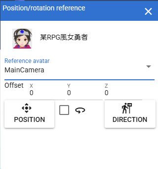
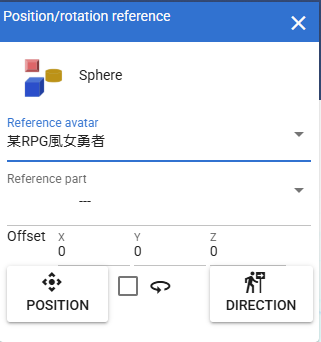
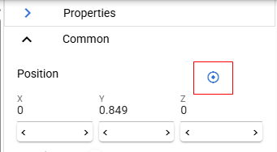

開き方
    1. VRMなどの3Dオブジェクトを選択し、プロパティパネルより、共通パネルを開きます。
    2. 位置の右端にあるボタンをクリックします。

    |transref03|

    3. 位置・回転の参照ウィンドウが開きます。

使用方法
    1. まずは移動や向きを変えたい3Dオブジェクトを選択します。

    .. hint::
        VRMの場合、移動や向きを変えたいIKマーカーを選択してください。（色がオレンジ色に変わった状態）
        これにより、移動や回転の対象がそのIKマーカーだけになります。

    2. 本ウィンドウを開きます。

    |transref01|

    3. 参照したいアバター（オブジェクト）を選択します。

    .. hint::
        メインカメラも選択できます。
    
    4. 参照アバターがVRMの場合、さらに参照部位を指定できます。

    |transref02|

    5. 必要に応じてOffsetを指定します。
    6. 移動させる場合は ``位置`` ボタン、向きを変える場合は ``向き`` ボタンをクリックします。

    .. hint::
        VRM自体を対象とする場合、IKマーカーを一つも選択しない状態か、あるいは ``移動モード`` のトグルスイッチをONにした状態で足元のIKマーカーを選択した状態で使用してください。

        .. image:: ../img/prop_common_transref04.png
            :align: center

        本ウィンドウ上では ``All`` と表示されます。

                

例
    最初の状態は次の状態とします。
    
    .. image:: ../img/prop_common_transref01.png
        :align: center

    :選択中のオブジェクト: VRM_A (左)
    :選択中のVRMの選択IKマーカー: LeftHand
    :参照アバター: VRM_B (右)
    :参照部位: Aim

    ``向き`` ボタンを押すとVRM_AのLeftHandはVRM_BのAimに向きます。

    .. image:: ../img/prop_common_transref02.png
        :align: center

    さらに ``位置`` ボタンを押すと、VRM_AのLeftHandはVRM_BのAimの場所に移動します。

    .. image:: ../img/prop_common_transref03.png
        :align: center

    これでVRM_Aの左腕はVRM_Bの上半身を指し示すようになり、簡単に複数人のポージングが実現できます。

    実際にはピッタリ同じ位置にある必要はないと思います。そのため微調整は手動で行う必要があります。

.. index:: 物理効果（操作）
 
物理効果
===========================

ver 2.4.0で追加した機能です。

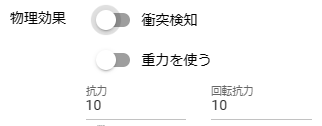

プロパティの説明は :ref:`rigid_property` を参照してください。

本アプリのIKマーカーはあくまでオブジェクトを動かすためのものです。
この設定はオブジェクト同士がぶつかったりときにどのように動くかを決めます。

オブジェクトがぶつかったら反応させる
    ``衝突検知`` のトグルスイッチをONにします。対象のオブジェクト全てに対して設定してください。

ぶつかった後の移動力を調整する
    ``抗力`` の値を変更してください。
    デフォルトは10です。低ければ低いほどオブジェクトの移動が停止するまでに時間がかかるようになります。

ぶつかった後の回転力を調整する
    ``回転抗力`` の値を変更してください。
    デフォルトは10です。低ければ低いほどオブジェクトの回転が停止するまでに時間がかかるようになります。

重力に従う
    ``重力を使う`` のトグルスイッチをONにします。ONにした瞬間、オブジェクトは地面に向かって落ちるようになります。
    IKマーカーで動かしている間はその位置と回転になりますが、操作をやめると再び重力に従って落下します。

.. hint::
    VR/AR空間で使うと、より現実の感覚で使用することができます。
    ハンドトラッキングが実用的なMetaQuest3以降のデバイスですと、オブジェクトを手に掴んで投げて別のオブジェクトにぶつけることもできます。

    本アプリが単なるポーズ・アニメーション作成だけでなく、様々な用途に使えるかもしれません。

.. index:: オニオンスキン

オニオンスキン
======================

ver 2.14.0より導入しました。現在選択中のオブジェクトのポーズをまるごと赤色のオブジェクトとしてコピーします。キーフレームを切り替えてモーションを作っていくときに、任意のフレームのポーズを残しておけるので、連続したモーションを作成するときに便利な機能です。

1. リボンバーの画面タブを開きます。
2.  ``Options`` エリアにある ``オニオンスキン`` のチェックボックスにチェックを入れます。

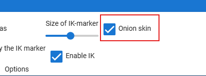

|

3. 現在選択中のオブジェクトの重なるようにオニオンスキン化したコピーオブジェクト（以後、オニオンスキン）が表示されます。

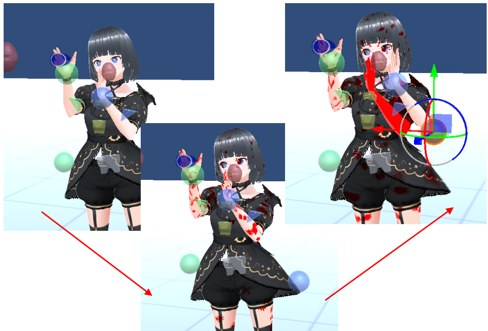

|

VRMの場合、元のVRMと重なった状態なので見た目は少々怖いですが、気にせず任意の部位のIKマーカーを動かしてください。

するとオニオンスキンは操作前のオブジェクトのポーズを保ったままになります。これで少しずつ動かしてキーフレームに登録していくことで、スムーズなモーションを作成しやすくなるでしょう。

イメージとしては次の操作をしていくことになります。

.. csv-table::

    1, オニオンスキンを表示
    2, ポーズを変更して動かす
    3, キーフレームに登録する
    4, オニオンスキンを非表示にする
    5, 次のフレームを選択する
    6, 1と同じ操作をする
    7, 以後、繰り返し

.. hint::
    以下の操作をするとオニオンスキンは非表示になります。

    * オニオンスキンのチェックボックスのチェックを外す
    * 別のオブジェクトを選択する

