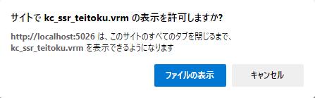
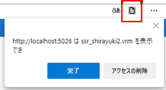

####################################
オブジェクト操作の基本
####################################

.. index:: オブジェクトを開く

オブジェクトを開く
====================

1. リボンバーのホームタブあるいは3Dモデルタブから各ボタンを押してください。

.. |ribbon_model| image:: ../img/operation_initial_4.png

==============  ===================
ホームタブ          3Dモデルタブ
--------------  -------------------
|ribbon_home|   |ribbon_model|
==============  ===================

VRMの場合
    　読み込み後、利用条件確認画面（VRM情報画面）が表示されます。そこで許可をしないと本当には読み込まれません。

それ以外
    　読み込み後、すぐに表示されます。

.. note::
    | ※エクスプローラーやファイラーから目的のVRMファイルをWebGL画面へとドラッグアンドドロップして開くこともできます。
    | ※設定「開いたファイルを履歴に保存する」により、一度開いた各オブジェクトは履歴が残るようになります。

|

.. index:: 基本の図形

シンプルな形のオブジェクト
==============================

　OtherObject扱いになる、基本的な形のオブジェクトを追加することができます。

1. リボンバーの3Dモデルタブから「基本の図形」をクリックします。

.. image:: ../img/operation_initial_5.png
    :align: center

|

※基本の図形は次の種類を開くことができます。

::

    球、カプセル、円柱、立方体、平面（3D）、四辺形（2D）

|

.. index:: 履歴から開く

履歴から開く
======================

　VRM・OtherObject、画像（UI画像含む）は一度開くとアプリ内に履歴が保存されます。次回起動時にはわざわざダイアログをたどったりドラッグしなくても、アプリ内で履歴から開くことができます。

1. リボンバーの「ホーム」タブにあるHistoryをクリックし、対象のオブジェクトの種類を選びます。

.. image:: ../img/operation_vrm_2.png
    :align: center

2. 内部ストレージダイアログが開くので対象のオブジェクトを選び、開きます。

3. 設定の「 **履歴にファイルの参照のみ保存する** 」がオンの場合、セキュリティ強化のためブラウザ版では次のような確認メッセージが表示されるので「ファイルを表示」をクリックします。

|

.. note::
    * これは端末のディスクへの参照を本アプリが保持しているため表示されるメッセージです。（一般的なWindows、Mac、Linuxなどのデスクトップアプリの動きと同等です）本アプリを信頼して頂ける場合は「ファイルの表示」をクリックして読み込みを継続してください。
    * スタンドアロン版は確認メッセージは表示されません。

　なお、読み込んだ（許可した）ファイルを後から確認するには、アドレスバーおよびウィンドウの右上付近のボタンから行えます。
許可を削除することもできます。

|

.. index:: オブジェクトの選択

オブジェクトの選択
============================

　全ての3Dオブジェクトは操作可能な状態になるとIKマーカーが表示されます。操作可能な状態にするには、オブジェクト一覧で選択してください。（TextとUImageは選択してもIKマーカーは表示されません）

.. image:: ../img/operation_initial_1.png
    :align: center

| 

※該当のオブジェクトが操作可能になるとIKマーカーがこのように表示されます。（それ以外のオブジェクトのIKマーカーは非表示になります。

.. warning::
    VRoid/VRMに装着中のオブジェクトは選択してもIKマーカーは表示されません。再び操作可能にするには装着を解除してください。

|

.. index:: オブジェクトの削除

オブジェクトの削除
==========================

オブジェクトを削除するには、オブジェクト一覧で右クリックして「オブジェクトを削除」をクリックします。

.. image:: ../img/operation_initial_2.png
    :align: center

|

.. note::
    この方法ではアニメーションプロジェクトのタイムライン（ロール）を削除することはできません。オブジェクトとタイムライン（ロール）両方を削除する場合は :doc:`../man4/animation_proper` を参照してください。

|

.. index:: オブジェクトの名前変更

オブジェクトの名前変更
=================================

オブジェクトの名前を変更することができます。これは後述のタイムライン（ロール）の名称とは別で、オブジェクト自体の名前・タイトルのことです。

1. オブジェクト一覧で対象を右クリックし、「名前変更」をクリックします。
2. 入力ダイアログで入力し、OKボタンを押して決定します。

|

カメラをフォーカスする
===============================

対象のオブジェクトがなるべくメインカメラに収まるようカメラの位置・回転を調整します。

1. オブジェクト一覧で対象を右クリックし、「カメラをフォーカスする」をクリックします。