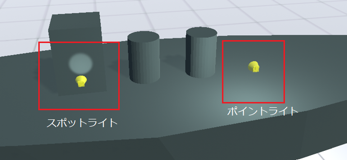

.. index:: Light
.. index:: スポットライト
.. index:: ポイントライト

####################################
Light
####################################

　Lightはその名の通り、3D空間におけるライティングを扱います。本アプリではUnityのライトのうち、スポットライト・ポイントライトを3Dオブジェクトとして操作できます。ディレクショナルライトはメインのライトとして扱うためこの分類では扱いません。

|

スポットライト
    特定の箇所に光を当てるタイプです。先述のプロパティで示すと、範囲で光が届く距離を、照射面の角度で光で照らされる面を拡大縮小します。

ポイントライト
    特定の領域を光で減らすイプです。先述のプロパティで示すと、範囲で光が届く距離と面積を拡大縮小します。

.. warning::
    ※Unityの仕様上、複数のライトが存在すると正しく表示されない場合があります。その場合はレンダーモードを1つ以上は「**重要**」に切り替えて使ってください。

    ※あまり多くの数を「重要」にすると動作速度に影響が出る場合がありますのでご注意ください。制限はご利用端末のCPUやグラフィックカードなどの性能に依存します。
