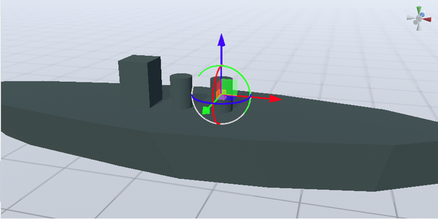
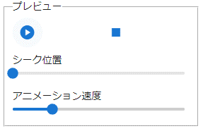
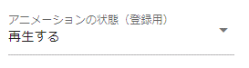

.. index:: OtherObject（オブジェクトの操作）
.. index:: オブジェクト（オブジェクトの操作）

####################################
OtherObject
####################################

　OtherObjectは基本的にはVRoid/VRM以外の一般的な3Dモデルを扱います。OtherObjectを始め、VRoid/VRM以外はIKマーカーは1つのオブジェクトにつき1個のみです。

.. contents::

　表示サイズはその3Dオブジェクトの実際のサイズに沿うので、VRoid/VRMや他のオブジェクトと大きく違う可能性があります。その場合は「共通」タブの「倍率」プロパティで変更してください。

　IKマーカーはその **オブジェクトの原点** に付きます。Blenderなどで出力時に実際のオブジェクトと原点がズレていると本アプリ上でもIKマーカーと実際のオブジェクトがズレます。意図したズレでない場合は出力元のアプリ側で適切に修正してください。

.. note::
    | ※FBXなど、アニメーションデータを持つ3Dオブジェクトは本アプリでも再生可能です。
    | ※ただし、利用ライブラリの仕様によりアニメーションの再生や選択に制限がかかる場合があります。

|

.. index:: アニメーション再生（OtherObject）

アニメーション再生
---------------------

　3Dオブジェクトのアニメーションは本アプリによるアニメーションプロジェクトの中でも再生をコントロールできます。

    

.. csv-table::

    プレビュー再生, アニメーション登録用
    |preview|, |anireg|
    即座に再生されます。こちらの操作はキーフレームには登録されません。, 「再生」や「停止」を選択後にキーフレームに登録します。

1. 再生するアニメーション名を選択します。
2. 必要に応じて再生モード・アニメーション速度などを調整します。 
3. 再生して確認します。
4. よければアニメーションの状態（登録用）で再生状態を選び、キーフレームの登録をします。

.. note::
    ※キーフレームに3Dオブジェクトのアニメーションデータが展開・表示されるわけではなく、あくまで再生・一時停止・停止・シークという状態がキーフレームに登録されるのみです。

.. hint::
    再生や停止ではなく、再生位置変更でシーク位置を変えることだけをキーフレームに登録していっても、そのオブジェクトのアニメーション再生を自由に行なえます。

    .. code::

        例）あるアニメーションを持つFBXをOtherObjectにした

        1フレーム目: アニメーションの状態（登録用） = 再生位置変更、シーク位置 = 0.855時点

        2フレーム目: アニメーションの状態（登録用） = 再生位置変更、シーク位置 = 0.124時点、間隔(duration)は1秒。

        → このFBXは逆再生のようにアニメーションする。

|

.. index:: テクスチャ（OtherObject）

テクスチャ
----------------

　3Dオブジェクトがテクスチャを複数保持している場合、テクスチャを選んで細かく設定変更することができます。VRMのほうの設定と全く同じです。

　詳しくは :doc:`operation_texture` を御覧ください。

