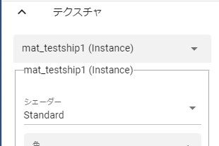

.. index:: OtherObject（オブジェクトの操作）
.. index:: オブジェクト（オブジェクトの操作）

####################################
OtherObject
####################################

　OtherObjectは基本的にはVRoid/VRM以外の一般的な3Dモデルを扱います。OtherObjectを始め、VRoid/VRM以外はIKマーカーは1つのオブジェクトにつき1個のみです。

.. image:: ../img/operation_oobj_1.png
    :align: center

　表示サイズはその3Dオブジェクトの実際のサイズに沿うので、VRoid/VRMや他のオブジェクトと大きく違う可能性があります。その場合は「共通」タブの「倍率」プロパティで変更してください。

.. note::
    | ※FBXなど、アニメーションデータを持つ3Dオブジェクトは本アプリでも再生可能です。
    | ※ただし、利用ライブラリの仕様によりアニメーションの再生や選択に制限がかかる場合があります。

|

.. index:: アニメーション再生（OtherObject）

アニメーション再生
---------------------

　3Dオブジェクトのアニメーションは本アプリによるアニメーションプロジェクトの中でも再生をコントロールできます。

    
.. |preview| image:: ../img/operation_oobj_2.png
.. |anireg| image:: ../img/operation_oobj_3.png

.. csv-table::

    プレビュー再生, アニメーション登録用
    |preview|, |anireg|
    即座に再生されます。こちらの操作はキーフレームには登録されません。, 「再生」や「停止」を選択後にキーフレームに登録します。

.. note::
    ※キーフレームに3Dオブジェクトのアニメーションデータが展開・表示されるわけではなく、あくまで再生・一時停止・停止・シークという状態がキーフレームに登録されるのみです。

|

.. index:: テクスチャ（OtherObject）

テクスチャ
----------------

　3Dオブジェクトがテクスチャを複数保持している場合、テクスチャを選んで細かく設定変更することができます。

|

.. note::
    ただしテクスチャの変更はこのアプリの使用中のみで実際には変更されません。

