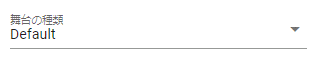
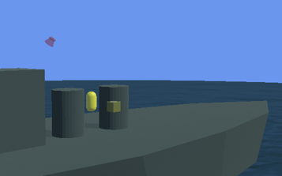
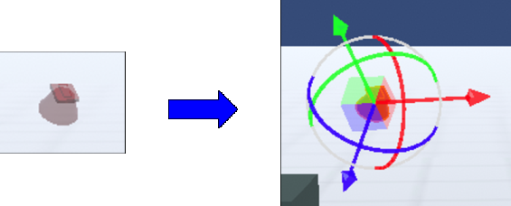
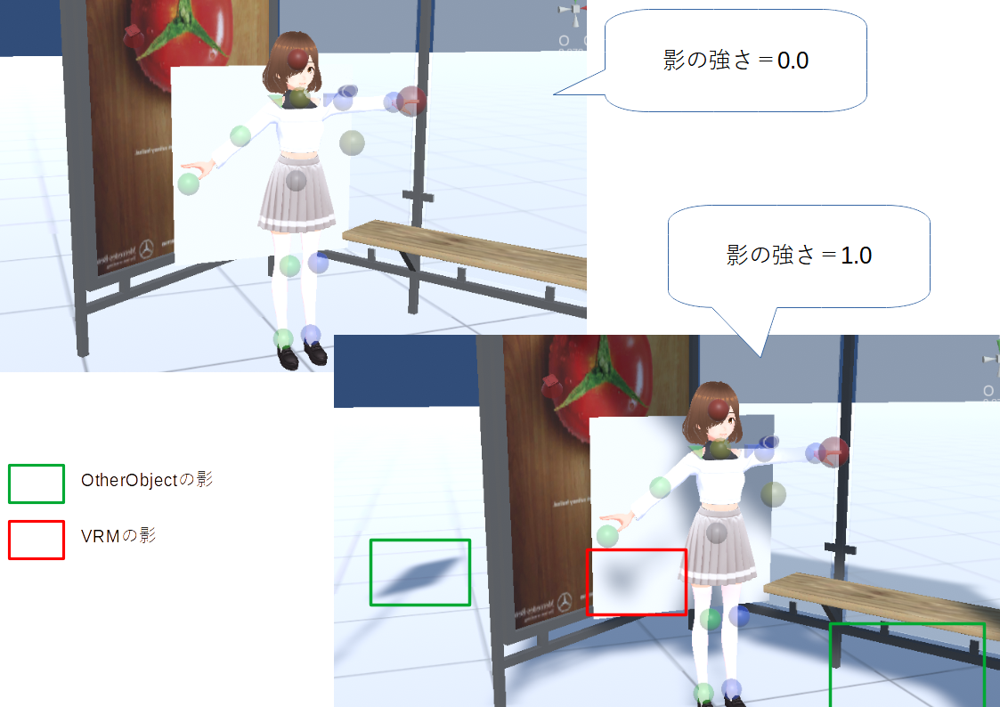
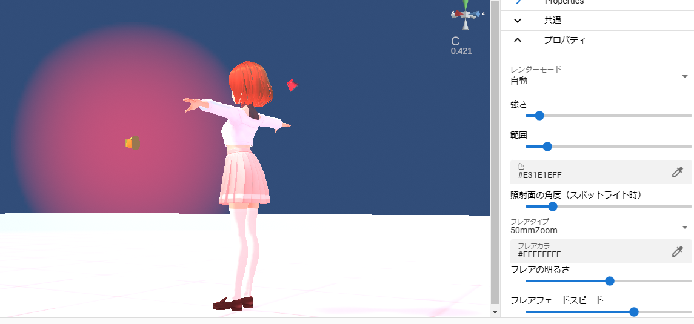
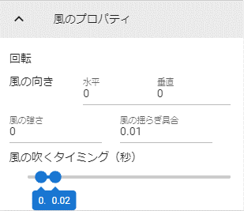
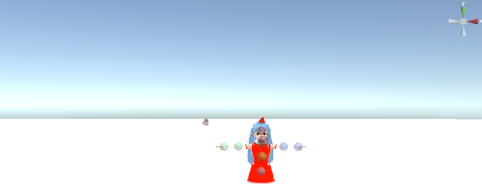

.. index:: Stage

####################################
Stage
####################################

　Stageは床や空、照明などの環境を扱います。

.. contents::

舞台
^^^^^^^^^^^^^^^^^^^^^^^^^^^^^^^^^^^

　舞台はコンボボックスから選択します。

|

※床を「SeaNight」、空の色を変更した例

|

.. index::
    SweetHome 3D
    建物の3Dモデル

.. hint::
    ※建築物や木などはOtherObjectを使って表現してください。

    
    建物や庭などを作るには、「SweetHome 3D」というアプリケーションがオススメです。このソフトの詳しい使い方は検索してください。

    http://www.sweethome3d.com/

    このソフトの活用のポイントは、Obj形式で3Dモデルをエクスポートできる点です。

    SweetHome3D製の3Dモデル(obj形式)を本アプリで読み込む場合、生成された以下のファイルを一つのzipファイルに圧縮して使ってください。

    * objファイル
    * mtlファイル
    * その他jpg、pngファイル

    | なお、本アプリのIKマーカーはSweetHome3Dでいうと0mの位置に相当する箇所に付きます。
    | それから、スケールはかなり大きくなりますので、 1～3%に変更して使うことをお勧めします。

水面の舞台
----------------------

    　BasicSeaLevel、DaytimeWaterStage、NighttimeWaterStageの3種類は海面・水面となる舞台です。それぞれ演出効果が若干異なります。

    　DaytimeWaterStage、NighttimeWaterStageの2種類はBasicSeaLevelや水面オブジェクトとは別のシェーダー・形状です。

    ..
        角が丸い平面となっており、他の舞台より若干地平線（水平線）が低めとなっています

    .. hint::
        OtherObjectの基本の図形にある ``水面`` を使うと地面の舞台を使いながら、部分的に水面を演出することができます。

UserStage
----------------------

    UserStageは自分で好きなテクスチャを貼り付けて表現できる舞台の種類です。

    1. コンボボックスから ``UserStage`` を選択します。
    2. プロパティが表示されるので、好みで設定します。
    
    :メインのテクスチャ:
        別途テクスチャファイルを事前に読み込んでおき、その素材名を選択します。
    :法線マップテクスチャ:
        法線マップのファイルを別途テクスチャファイルとして事前に読み込んでおき、その素材名を選択します
    :色:
        テクスチャのベースの色
    :ブレンドモード:
        シェーダのMode
    :メタリック:
        シェーダのMetallic
    :光沢:
        シェーダのGlossiness
    :発光色:
        シェーダのEmission Color

    .. caution::
        VRMやOtherObjectと異なり、シェーダー自体を切り替えることはできません。

    |

.. index:: 照明
.. index:: ディレクショナルライト

照明（ディレクショナルライト）
^^^^^^^^^^^^^^^^^^^^^^^^^^^^^^^^

　照明（Directional light）はWebGL上では赤い電灯のような図形で表します。これを操作ハンドルで回転することで光の照射の角度を指定できます。（移動は反映されません。あくまで操作ハンドルを扱いやすくするためだけの効果です）

|

　空が通常の空かつ ``sky daytime`` の場合、太陽の位置としても使われます。

.. note::
    ※Stageの照明はLightオブジェクトのように削除はできません。

.. index:: オブジェクトの影（オブジェクトの操作）

**オブジェクトの影**

　本アプリでの影の濃さはStageのプロパティで設定できます。この設定は全オブジェクトに共通です。

|

　また、Lightオブジェクトの使い方により、他のオブジェクトに当たって表示される影の強さ・濃さが変わってきます。

|

ハロー
-------------

| 　Lightオブジェクトにはハロー（円光）を表示させることができます。ただしUnityの仕様上、個別のライトに対してハローコンポーネントを動的に細かく制御することができません。
| 　本アプリではシステム的なライトである ``照明`` にて、全体に対するハローを制御させることができます。

具体的には次の手順を踏むことにより、ハローを細かく制御できます。

1. Stageの ``照明`` にて、ハローの基本値を指定します。
2. 各Lightオブジェクトの色や強さ・範囲を指定します。
3. 各Lightオブジェクトのハローの効果が変化します。

|

　この通り、光の周りにモヤが表示されるようになります。明確に個々のLightオブジェクトのハローのON/OFFは切り替えられませんが、ハローの基本値とLightオブジェクト側の範囲の指定により調整はできます。

.. index:: 風（オブジェクトの操作）

風
^^^^^^^^^^^^^^^^

　風を吹かせることでVRMに含まれるボーンが自然と揺れる演出をすることができます。風は「風の強さ」ｘ「風の揺らぎ具合」で計算しています。

※風の揺らぎ具合は実際には次の範囲でランダムです。

| 　最小：風の揺らぎ具合 * -1
| 　最大：風の揺らぎ具合

|

　そして「風の吹くタイミング」で指定した最小値、最大値の範囲でランダムな間隔で吹かせることができます。ここを適切に指定することにより、自然な風を演出することができます。

.. warning::
    風の設定ではVRMのボーンの重力設定を直接操作しています。VRM側で重力設定をする場合、風は使わないでください。操作が競合してしまいます。

.. warning::
    VRM1.xのSpringBoneの仕様変更により、本機能も挙動が若干変わりました。今後とも引き続き調整しますのでご了承下さい。  
 
|

.. index:: 空（オブジェクトの操作）

.. _operation_sky:

空
^^^^^^^^^^^^^^^^^^^

　空は通常の空と単色の２モードあります。デフォルトは単色です。「単色」のときは空の色しか設定できませんが、「通常の空」にすると設定を細かく行うことができます。

|

.. |skydaytime| image:: ../img/prop_stage_2.png
.. |skynight| image:: ../img/prop_stage_3.png

.. csv-table::
    
    sky daytimeの場合（昼間の空）, sky night blue/sky night purpleの場合（夜の空）
    |skydaytime|,   |skynight|

.. note::
    * 各設定についてはUnityの公式リファレンスを参照してください。
    * sky daytimeの場合、太陽が存在します。太陽の位置は照明の回転の角度により変化します。

.. warning::
    アンチエイリアスを有効にしていると、``sky night~`` の2つはキャプチャ時に不要な線が交じることがあります。これはWebGLの仕様です。ご了承下さい。
