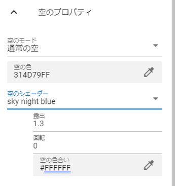

.. index:: Stage

####################################
Stage
####################################

　Stageは床や空、照明などの環境を扱います。

舞台
^^^^^^^^^^^^^^^^^^^^^^^^^^^^^^^^^^^

　舞台はコンボボックスから選択します。

.. image:: ../img/operation_stage_1.png
    :align: center

|

※床を「SeaNight」、空の色を変更した例

.. image:: ../img/operation_stage_2.png
    :align: center

|

.. hint::
    ※建築物や木などはOtherObjectを使って表現してください。

UserStageの場合
----------------------

UserStageは自分で好きなテクスチャを貼り付けて表現できる舞台の種類です。

1. コンボボックスから ``UserStage`` を選択します。
2. プロパティが表示されるので、好みで設定します。
   
:メインのテクスチャ:
    別途テクスチャファイルを事前に読み込んでおき、その素材名を選択します。
:法線マップテクスチャ:
    法線マップのファイルを別途テクスチャファイルとして事前に読み込んでおき、その素材名を選択します
:色:
    テクスチャのベースの色
:ブレンドモード:
    シェーダのMode
:メタリック:
    シェーダのMetallic
:光沢:
    シェーダのGlossiness
:発光色:
    シェーダのEmission Color

.. caution::
    VRMやOtherObjectと異なり、シェーダー自体を切り替えることはできません。

|

.. index:: 照明
.. index:: ディレクショナルライト

照明(ディレクショナルライト)
^^^^^^^^^^^^^^^^^^^^^^^^^^^^^^^^

　照明（Directional light）はWebGL上では赤い電灯のような図形で表します。これを操作ハンドルで回転することで光の照射の角度を指定できます。（移動は反映されません。あくまで操作ハンドルを扱いやすくするためだけの効果です）

.. image:: ../img/operation_stage_3.png
    :align: center

|

.. note::
    ※Stageの照明はLightオブジェクトのように削除はできません。

|

.. index:: 風（オブジェクトの操作）

風
^^^^^^^^^^^^^^^^

　風を吹かせることでVRMに含まれるボーンが自然と揺れる演出をすることができます。風は「風の強さ」ｘ「風の揺らぎ具合」で計算しています。

※風の揺らぎ具合は実際には次の範囲でランダムです。

| 　最小：風の揺らぎ具合 * -1
| 　最大：風の揺らぎ具合

.. image:: ../img/operation_stage_4.png
    :align: center

|

　そして「風の吹くタイミング」で指定した最小値、最大値の範囲でランダムな間隔で吹かせることができます。ここを適切に指定することにより、自然な風を演出することができます。

.. warning::
    風の設定ではVRMのボーンの重力設定を直接操作しています。VRM側で重力設定をする場合、風は使わないでください。操作が競合してしまいます。

|

.. index:: 空（オブジェクトの操作）

空
^^^^^^^^^^^^^^^^^^^

　空は通常の空と単色の２モードあります。デフォルトは単色です。「単色」のときは空の色しか設定できませんが、「通常の空」にすると設定を細かく行うことができます。

.. image:: ../img/operation_stage_5.png
    :align: center

|

.. |skydaytime| image:: ../img/prop_stage_2.png

.. csv-table::
    
    sky daytimeの場合（昼間の空）, sky night blue/sky night purpleの場合（夜の空）
    |skydaytime|,   |skynight|

.. note::
    | ※各設定についてはUnityの公式リファレンスを参照してください。
    | ※sky daytimeの場合、太陽が存在します。太陽の位置は照明の回転の角度により変化します。
