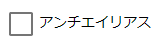

.. index:: SystemEffect（オブジェクトの操作）

####################################
SystemEffect
####################################

　SystemEffectはUnityの用語でいうPost-processingです。世間的なわかりやすさを重視して「システム」＋「エフェクト」＝「システムエフェクト」という名称で本アプリでは扱います。

.. |syseff1| image:: ../img/screen_ribbon_syseff1.png
.. |syseff2| image:: ../img/screen_ribbon_syseff2.png

.. csv-table::

    |syseff1|
    |syseff2|

|

　SystemEffectではPost-processingの次の効果を使用できます。すべてのオプションではなく一部のオプションのみです。

::

    Bloom、Chromatic Abberation、Color grading、Depth of field、Grain、Vignette、Motion blur

.. warning::
    ※効果を多用すると動作が重くなる可能性があります。

|

.. index:: 画面のトランジション

**画面のトランジション**

画面を暗転などして画面を切り替える演出はこれらのシステムエフェクトを組み合わせて表現してください。

|

.. index:: アンチエイリアス

**アンチエイリアスについて**

:|antialias|:
    　アンチエイリアスはSystemEffectではなく、リボンバーの「画面」タブの「アンチエイリアス」で設定してください。（アニメーションプロジェクトのキーフレームには登録できません）

**アニメーションプロジェクトへの登録方法**

　システムエフェクトをアニメーションプロジェクトに登録するには、タブ内の ``キーフレーム登録`` ボタンか、 ``システムエフェクト`` タブ内で右クリック [1]_ して ``キーフレーム登録`` ボタンをクリックします。

.. image:: ../img/screen_ribbon_animation_keyframe2.png
    :align: center

|

※このタブ内で右クリックした場合に表示される「キーフレーム登録」はシステムエフェクト専用です。3Dオブジェクトをなにか選択していたとしても、 **必ずシステムエフェクトだけを対象** にしますので、お間違えないようご注意ください。

.. [1] macOSの場合はControlキー + クリックまたは2点タップ