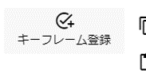

.. index:: SystemEffect（オブジェクトの操作）

####################################
SystemEffect
####################################

　SystemEffectはUnityの用語でいうPost-processingです。世間的なわかりやすさを重視して「システム」＋「エフェクト」＝「システムエフェクト」という名称で本アプリでは扱います。

.. image:: ../img/screen_ribbon_syseff.png
    :align: center

|

　SystemEffectではPost-processingの次の効果を使用できます。すべてのオプションではなく一部のオプションのみです。

::

    Bloom、Chromatic Abberation、Color grading、Depth of field、Grain、Vignette、Motion blur

.. warning::
    ※効果を多用すると動作が重くなる可能性があります。

|

.. |antialias| image:: ../img/operation_syseff_1.png

.. index:: アンチエイリアス

**アンチエイリアスについて**

:|antialias|:
    　アンチエイリアスはSystemEffectではなく、リボンバーの「画面」タブの「アンチエイリアス」で設定してください。（アニメーションプロジェクトのキーフレームには登録できません）

**アニメーションプロジェクトへの登録方法**

　システムエフェクトをアニメーションプロジェクトに登録する場合は同じタブ内にある「キーフレーム登録」ボタンを使用します。

|

※このタブ内の「キーフレーム登録」はシステムエフェクト専用です。このタブ内の同ボタンは、オブジェクトなどで何を選択していても、必ずシステムエフェクトだけを対象にしますので、お間違えないようご注意ください。
