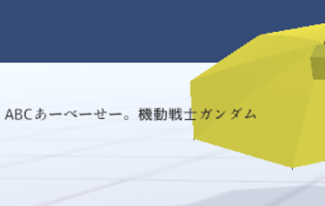

####################################
Text
####################################

　Textは3Dオブジェクトではなく、HTMLのような2Dです。主にUIとしてテキストを表示することができます。
　3Dオブジェクトよりも優先して描画されます。

|

　位置を示すX,Y座標はUnityとは異なり、わかりやすさを重視してHTMLなどと同様に左上を(0, 0)として表します。また、Unityの仕様上2Dも実際は3Dオブジェクトのため回転も本来X座標、Y座標でできるのですが、本アプリではわかりやすさ重視のため、Z座標のみの回転としています。（X座標、Y座標は自動設定です）

.. image:: ../img/prop_common_2.png
    :align: center

|

　Textももちろんアニメーションプロジェクトに対応しています。
