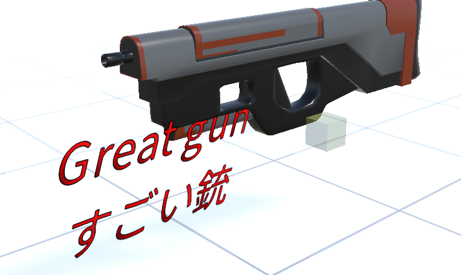

####################################
Text3D
####################################

　Text3Dは3Dオブジェクトです。Textと異なり、3D空間で使うことができます。もちろん本アプリのモーションに対応しています。

|

3Dオブジェクトなので扱いはOtherObjectやImageなどと同等に操作ができます。

.. admonition:: 大きさ

    Text3Dでは大きさをフォントサイズと共通プロパティの倍率(%)でも変えることができますが、その意味は全く異なります。

    :フォントサイズ: テキストオブジェクト自体の大きさを変更します。
    :倍率: 
        テキストの表示の大きさを変更します。X軸・Y軸別々に指定すれば、さらに見た目を変えることができます。
        
        テキスト自体の大きさは変わらないので、あまりに倍率が大きいと荒く表示される可能性があります。

