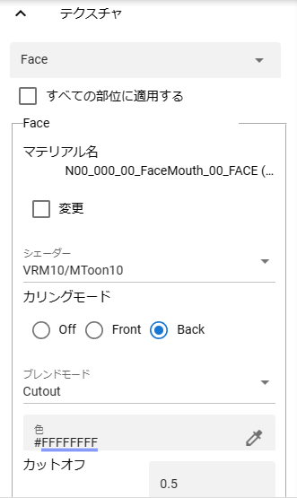
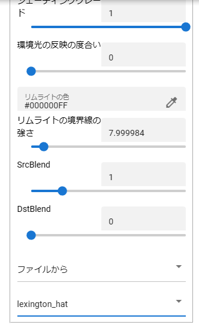
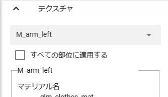
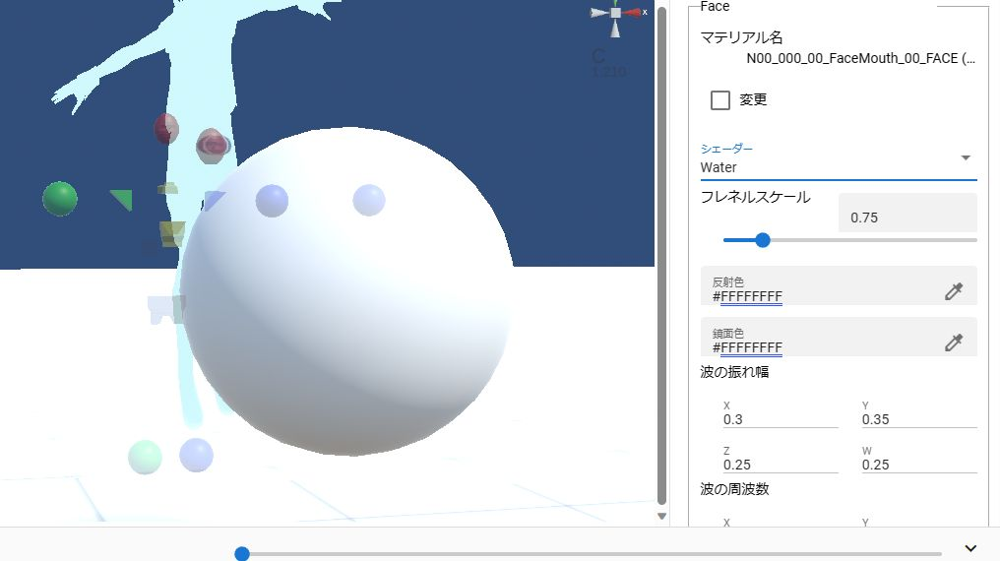
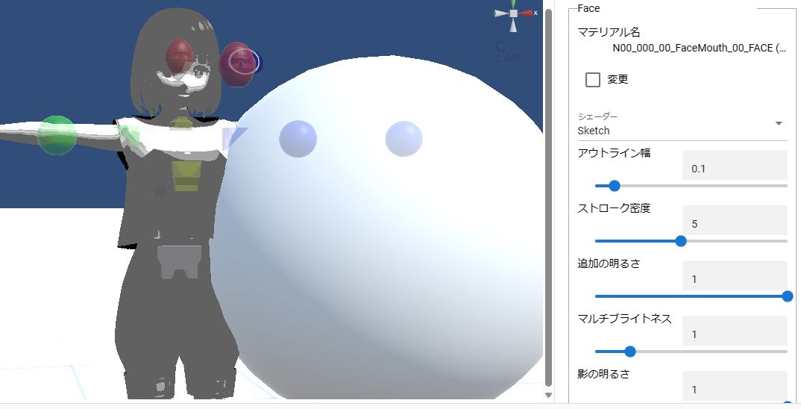
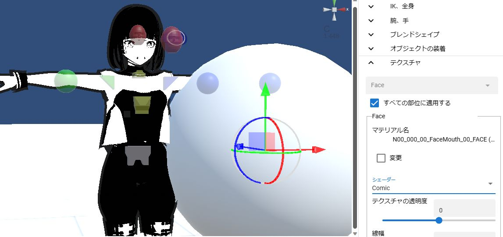
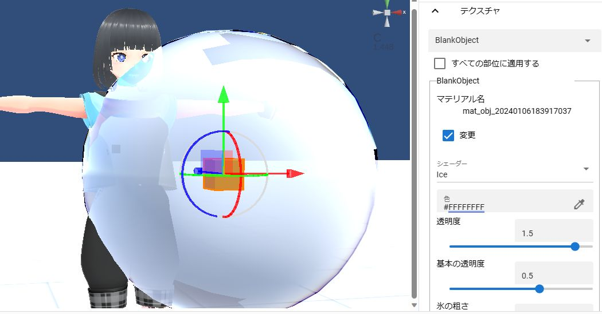
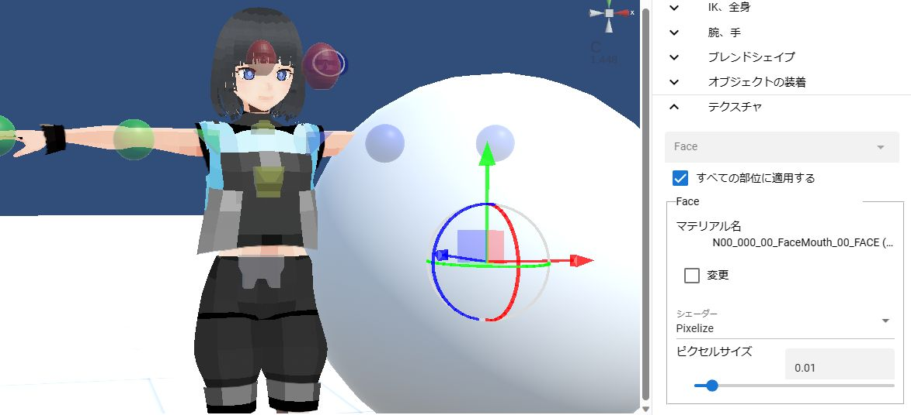
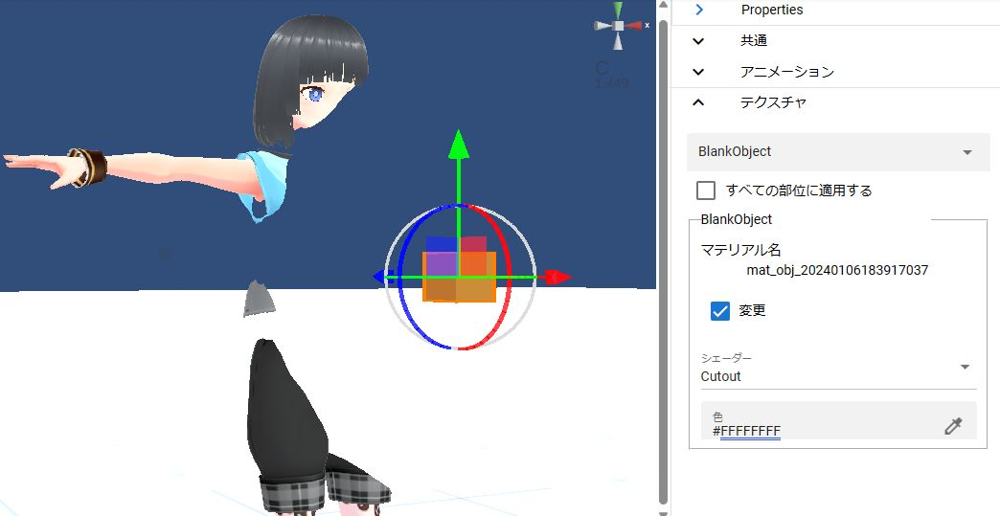

.. index:: OtherObject（オブジェクトの操作）
.. index:: オブジェクト（オブジェクトの操作）

####################################
テクスチャ
####################################

テクスチャの設定はVRMとOtherObjectに共通して存在します。

.. contents::

詳しい説明は各サイトを御覧ください。

.. csv-table::

    Standard assetのWater, https://docs.unity3d.com/ja/2019.1/Manual/HOWTO-Water.html
    MToonリファレンス, https://virtualcast.jp/wiki/unity/shader/mtoonreference
    デッサン風シェーダー, https://usagi-meteor.booth.pm/items/4453497
    コミックシェーダー, https://booth.pm/ja/items/2138884
    氷シェーダー, https://booth.pm/ja/items/2138863

テクスチャの操作
=========================
　VRMやOtherObjectが保持しているテクスチャを細かく設定変更することができます。なお、両者の設定と使用方法は全く同じです。

.. csv-table::

    |texmenu1|, |texmenu2|

|

1. マテリアルが複数存在する場合は上部のコンボボックスから対象のマテリアルを選択します。

※テクスチャの設定の内容が切り替わります。

2. 各種設定を好みで変更します。
3. ``変更`` にチェックを入れます。

.. note::
    ver 2.3.0より、チェックボックスをONにしたマテリアルのみキーフレームに登録されるように変更しました。

    もし登録を望まない場合はチェックを外せばそのマテリアルの値は保存されません。

    これにより、モーションやプロジェクトに保存されるテクスチャの設定も本当に変更したものだけになり、ファイルサイズの削減を実現しました。

すべての部位に適用する
-------------------------

|

　基本的には一つのマテリアルごとに設定していくことになりますが、マテリアルの数が多かったり、モデルの見た目を一括して変えたい場合、このオプションにチェックを入れてからテクスチャの設定を変更することで、全て同時に変更できるようになります。

　なお、チェックを入れている間はマテリアルを選ぶことはできません。

テクスチャの詳細
=============================

:シェーダー:
    ``Standard`` ,  ``VRM/MToon`` , ``VRM10/MToon10`` , ``Water``, ``Sketch``, ``PostSketch``, ``Comic``, ``Ice`` , ``Pixelize`` , ``Cutout`` のいずれかを選択します。

.. caution::
   * テクスチャの変更はこのアプリの使用中のみで実際には変更されません。
   * 各色のプロパティの不透明度はWebGLの場合適切に反映されないことがあります。ご了承ください。
   * 同じマテリアルを使用しているテクスチャ（メッシュ）が複数ある場合、アニメーションプロジェクトにおいてはその最後のテクスチャの設定のみが最終的に反映されます。（例: Aというマテリアルを使用しているテクスチャが3つ存在する場合、3番目の設定が最後に適用される）
   * VRM 0.xモデルも本アプリで読み込むとVRM 1.xの仕様に従っています。そのため、基本的にシェーダーは ``VRM10/MToon10`` を使用してください。
   * Standard, VRM/MToon, VRM10/MToon10以外のシェーダーはUnityのバージョンやレンダリングの仕様により、変更する可能性があります。

Standard
--------------------

Unity標準のテクスチャです。

:色:
    テクスチャのベースの色を変更します。
:ブレンドモード:
    ``Opaque``、 ``Cutout``、 ``Fade``、 ``Transparent`` のいずれかを選択します。

:カリングモード:
    ``Off``、 ``Front``、 ``Back`` のいずれかを選択します。
:メタリック:
    金属のような表面にします。
:光沢:
    表面に輝きを追加します。
:発光色:
    Emission Colorです。
:テクスチャの種類:
    ``ファイルから``、あるいは ``カメラから`` を選択します。いずれの場合も ``--`` を選ぶと参照を解除できます。

    ファイルから [1]_
        別途読み込み済みのテクスチャファイルに付けた素材名を選択して読み込みます。元のテクスチャに戻す場合は ``--`` を選択してください。        
    カメラから [2]_
        プロジェクトに存在するカメラオブジェクトを選択します。別途カメラオブジェクト側でレンダーテクスチャの設定をしておく必要があります。

.. hint::
    .. [1] リボンバーの ``アニメーション`` タブ → ``設定`` ボタン → ``素材`` タブ　にて必要なテクスチャファイルを事前に読み込んでください。
    .. [2] Cameraオブジェクトで事前にレンダーテクスチャを設定しておいてください。

VRM10/MToon10
--------------------

VRM 1.0標準のシェーダーです。VRM 0.xのものとは若干異なります。

:色:
    テクスチャのベースの色を変更します。
:ブレンドモード:
    ``Opaque``、 ``Cutout``、 ``Fade``、 ``Transparent`` のいずれかを選択します。

:カリングモード:
    ``Off``、 ``Front``、 ``Back`` のいずれかを選択します。
:カットオフ:
    0.5が基本値です。それより低いと欠けたテクスチャが次第に表示されていきます。1.0だと完全に透明になります。
:発光色:
    _EmissionColorです。
:シェードの色:
    _ShadeColor です。
:影の境界線のなめらかさ:
    Shading Toonyです。
:影のかかる領域:
    Shade Shiftです。
:影の受け具合:
    Receive Shadowです。
:シェーディンググレード:
    Shading Gradeです。
:環境光の反映の度合い:
    Light Color Attenuationです。
:リムライトの色:
    Rim colorです。
:リムライトの境界線の強さ:
    Rim Fresnel Powerです。
:SrcBlend～DstBlend:
    色と透過を複合的に変化させて適用します。詳しくはVRM/MToonの解説サイトを検索してください。

:テクスチャの種類:
    Standardと同様です。

Water
----------------

水面を表現するシェーダーです。

:フレネルスケール:
    Fresnel Scaleです。
:反射色:
    光に照らされた際の水面の色です。
:鏡面色:
    水面の反射したものの色です。
:波の揺れ幅、波の周波数、波の急勾配、波の速度、波方向AB、波方向CD:
    波の頻度や大きさなどを変化させます。

水面以外の目的でこのシェーダーを適用するとオブジェクトがゆらゆら揺れ動くように描画されます。

|

Sketch、PostSketch
-------------------------

スケッチ風の描写になるシェーダーです。

:アウトライン幅:
    テクスチャのオブジェクトの周囲に線を付けます。
:ストローク密度:
:追加の明るさ:
:マルチブライトネス:
:影の明るさ:
    Sketchのみです。

.. |img_pske| image:: ../img/prop_obj_4e.jpg

.. csv-table::
    :header-rows: 1

    Sketch , PostSketch
    |img_ske| , |img_pske|
    適用したオブジェクト自体がスケッチ風に描画されます。, 適用したオブジェクトを通して他のオブジェクトがスケッチ風に描画されます。

|

.. admonition:: 配布・購入先

    うさぎ流星群様

    https://usagi-meteor.booth.pm/items/4453497

Comic
--------------

漫画風の描写になるシェーダーです。

:テクスチャの透明度:
    VRM10/MToon10のカットオフと似た効果です。欠けたテクスチャを透明にします。
:線幅:
    テクスチャのオブジェクトの周囲に線を付けます。
:色:
    線や影の色を変えます。
:トーンのしきい値:
    トーンの範囲を変えます。

|

.. admonition:: 配布先

    Xin Games様

    https://booth.pm/ja/items/2138884

Ice
------------

氷のような描写になるシェーダーです。

:色:
    氷の表面の色を変えます。
:透明度:
    透明度がプラスの値だと氷として色がはっきりします。0に近づくと透明になります。マイナスが多くなると透明ではなく色が反転し始めます。
:基本の透明度:
    透明度にさらに透明度をかけ合わせます。
:氷の粗さ:
    氷をギザギザに荒くします。
:ねじれ:
    氷に反射したものの形のねじれ具合を変えます。

|

.. admonition:: 配布先

    Xin Games様
    
    https://booth.pm/ja/items/2138863

.. caution::
    このシェーダーはAR空間では正しく表示されないことがあります。

|

PixelizeTexture
---------------------

某ブロック風のテクスチャになるシェーダーです。これはChatGPTによって一から作った独自のシェーダーです。

:ピクセルサイズ:
    ピクセル化するテクスチャのサイズです。これを大きくすればするほどモザイク的になります。

|

.. _shader_cutout:

Cutout
---------------------

このシェーダーを適用したオブジェクトは透明になります。そしてこのオブジェクトに重なったり背後にある別のオブジェクトは、このオブジェクトの形でくり抜かれたように表示されます。

:色:
    実際には設定しても意味がありません。

|

.. hint::
    このシェーダーはVR/ARでも効果があります。

.. note::
    VR/ARの左手の仮想コントローラにある **透明化** のボタンを押すと、自動的に全てのマテリアルのシェーダーをCutoutに切り替えます。
