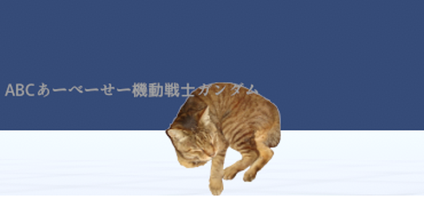
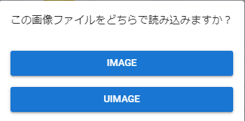

####################################
UImage
####################################

　UImageもText同様3Dオブジェクトではなく、UIとして画像を表示します。
　3Dオブジェクトよりも優先して描画されます。

|

.. note::
    UImageはTextよりも下に描画されます。

　また、画像はドラッグアンドドロップするとImageとUImageどちらとして読み込むか確認メッセージが表示されます。目的の種類の方をクリックして読み込みを進めてください。

