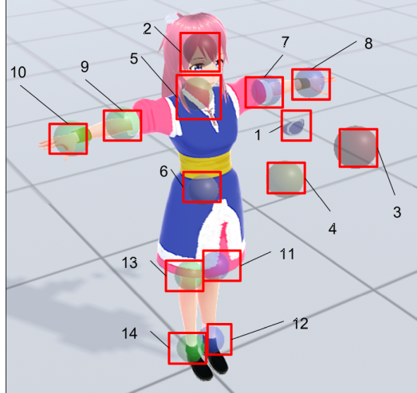
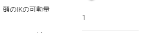

####################################
VRoid/VRM
####################################

　VRoid/VRMを読み込んでポーズを取らせたり後述のアニメーションを作成して楽しめるのが本アプリのメインの特徴です。VRMファイルの読み込みから実際の操作まで、一連の操作を説明していきます。

.. index:: VRMの利用条件を確認する

VRMの利用条件を確認する
--------------------------------

　読み込みが進むとVRoid/VRMの利用条件確認画面が表示されます。自分以外の製作者のVRMファイルを読み込んだ場合、利用条件をよく確認し承諾できれば「OK」ボタンを押して読み込みを完了させてください。

.. image:: ../img/operation_vrm_5.png
    :align: center

　この後WebGL画面に目的のVRoid/VRMが表示されます。

.. note:: 
    * VRMを履歴から開いた場合、オプションによってはこの確認画面を省略することができます。
    * VRoidStudio 1.xのモデルと0.xのモデルは関節の形状や初期ポーズなどが異なります。本アプリではその差異をなるべく吸収していますが、VRoidStudio 1.xから出力した直後のモデルは次ページの11, 13のIKの初期表示が若干ずれます（動かし始めれば問題ありません）。

|

.. index:: IKマーカーの操作（VRMの操作）

VRMのIKマーカーの操作
--------------------------

　読み込んだVRoid/VRMには図のようにIKマーカーと称する半透明の図形がついています。それぞれ次の部位の動きに連動しています。また、部位ごとにIKマーカーの操作の種類が決まっています。

|

.. csv-table::
    :header-rows: 1

    No, 部位, 対応操作,                           No, 部位, 対応操作
    1,  視線（EyeViewHandle）,移動,               2,   頭の左右の傾き・顎突き出し（Head）,移動
    3,  頭の向き（LookAt）,移動,                  4,   上半身の向き（Aim）,移動
    5,  上半身・肩の左右の傾き（Chest）,移動,      6,  腰の向き・傾き・移動（Pelvis）,移動・回転
    7,  左ひじ（LeftLowerArm）,移動 ,              8,   左手（LeftHand）,移動・回転
    9,  右ひじ（RightLowerArm）,移動,              10,  右手（RightHand）,移動・回転
    11, 左足の方向（LeftLowerLeg）≠ひざ,移動,        12, 左足首（LeftLeg）,移動・回転
    13, 右足の方向（RightLowerLeg）≠ひざ,移動,      14, 右足首（RightLeg）,移動・回転

.. note::
    * 対応していない操作をしてもその部位に動きはありません。
    * 可能な限り複雑でなく・面倒くさくなく・それでいて自在にポーズの編集をしていただくため、操作可能な部位はこれだけとなっています。そのため、操作が膨大になる FK (Forward Kinematics) にも対応していません。
    * 世間的には厳密な言い方があるかもしれませんが、本アプリでは上記の各ボーン（部位）のこと＝IKマーカー（パーツ）として表記して説明していきます。
    * 11と13はひざとはまったく同じ意味ではありません。足の全体的な向きと捉えてください。

|

各IKマーカーの操作
^^^^^^^^^^^^^^^^^^^^

　選択した各IKマーカーをクリックすると図のようになります。これが操作ハンドルです。

.. image:: ../img/operation_vrm_7.png
    :align: center

|

X,Y,Z軸移動
    　緑＝Y、青＝Z、赤＝X軸として、ドラッグするとその方向にIKマーカーを移動します。その移動量だけ体の該当部位も移動します。

中心の平面
    　真ん中の同じ色で四角のボックスは、その中をドラッグするとその面が示す軸ともう片方の軸のみで自由に移動させることができます。

.. index:: IKマーカーの特殊な操作（VRMの操作）

特殊な操作
^^^^^^^^^^^^^^^

　IKマーカーを選択した状態で次のキーを押すと特別な機能が使えます。

Ctrlキーを押しながらIKマーカーをクリック
    　IKマーカーを複数選択することができます。複数選択した状態で移動や回転を行うと複数の体の部位を同時に動かすことができます。
    　なお、操作ハンドルも当たり判定があるので、カメラをズームするなどしてIKマーカーだけを選択してください。

Xキーを押下
    グローバル座標・ローカル座標を切り替えます。デフォルトはローカル座標です。

Gキーを押下
    IKマーカーを移動のみにします。

Rキーを押下
    IKマーカーを回転のみにします。

Tキーを押下
    IKマーカーを初期状態に戻します。（移動・回転両方）

Shift + Zキーを押下
    IKマーカーによる移動・回転を元に戻します。

Shift + Yキーを押下
    IKマーカーによる移動・回転をやり直します。

|

.. index:: 移動・回転（VRMの操作）

VRoid/VRM自体の移動・回転
^^^^^^^^^^^^^^^^^^^^^^^^^^^^^^

　選択したVRoid/VRM自体を移動・回転するには、右のプロパティの「IK、全身」タブにある「移動モード」をONにします。

.. image:: ../img/operation_vrm_8.png
    :align: center

|

　すると、VRoid/VRMの足元付近をクリックするとIKマーカー全部が選択状態になります。表示されませんが実際にはここが全体のIKマーカーとなっています。

.. warning::

    ※足首と全体のIKマーカーが干渉しやすいため、移動しない場合は適時OFFに切り替えてください。

|

.. image:: ../img/operation_vrm_9.png
    :align: center

　この状態で上下左右に移動・回転するとVRoid/VRM自体がそのとおりに動きます。これはプロパティの「共通」タブから数値で設定もできます。

.. image:: ../img/prop_common_1.png
    :align: center

　共通タブからはVRoid/VRMの全体の大きさも調整できますが、VRoid/VRMは読み込んだ時点のサイズが理想のサイズです。この倍率はあまり極端に変更しないことをオススメします。（IKマーカー自体のサイズまでは追随しないためIKマーカーと体の部位の位置がズレます）

|

.. index:: Tポーズに戻す（VRMの操作）

全ボーンをTポーズに戻す
^^^^^^^^^^^^^^^^^^^^^^^^^^^^^

　IKマーカーをいじりすぎて求めるポーズに戻せなくなった場合、リボンバーの **3Dモデル** タブの **全ボーンをリセット** を押すとTポーズ（デフォルトのポーズ）に戻すことが出来ます。

.. image:: ../img/operation_vrm_a.png
    :align: center

|

　また、全体の位置や回転も **位置をリセット**、**回転をリセット** で戻すことが出来ます。

.. image:: ../img/operation_vrm_b.png
    :align: center

|

.. index:: IKマーカーを数値で操作する

IKマーカーを数値で操作する
^^^^^^^^^^^^^^^^^^^^^^^^^^^^^^^^

　IKマーカーをマウスやタッチで操作するほか、実際の数値で入力して操作することもできます。目的のVRoid/VRMを選択し、右のプロパティの「**IK、全身**」タブにある「**IK位置の一括変更**」のボタンを押します。

.. image:: ../img/operation_vrm_c.png
    :align: center

|

| 　専用のダイアログが表示されます。ここでスプレッドシート形式で各IKマーカーの位置や回転を直接指定することができます。目的の箇所を変更し終わったら最後に「**ポーズを適用**」ボタンを押します。
| 　すると対象のVRoid/VRMの現在のポーズがそのとおりに変更されます。

.. image:: ../img/screen_ikmarker.png
    :align: center

|

.. index:: 可動範囲の制限を調整する（VRMの操作）

可動範囲の制限を調整する
^^^^^^^^^^^^^^^^^^^^^^^^^^^^^^^^^

| 　本アプリではVRMは標準でいくつかの可動範囲の制御が適用されます。それらによりVRMが無理なく自然な人体の動きを再現できます。
| 　しかしながら本アプリのIKと競合することもあり、それが原因でポーズやアニメーションが再現しきれない仕様も備わってしまっています。人体として多少不自然でもいいから完全に自由にポージングさせたい場合、これらIKマーカーの制限を外すことができます。

腰（Pelvis）と足（LowerLeg）、足首（Leg）と足の方向（LowerLeg）の連動、手（Hand）と腕（LowerArm）の連動
    腰（Pelvis）と足（LowerLeg）
      * 腰を上下したときに足（LowerLeg）がその動きに合わせて前後に若干移動
    足首（Leg）と足の方向（LowerLeg）の連動
      * 足首を移動させたときに足（LowerLeg）を前後に若干移動
    手（Hand）と腕（LowerArm）の連動 
      * 手を移動させたときに腕（肘）も追随して移動
      * 腕の回転軸に合わせて手も回転

    | ※これらはキーフレームのプレビューやポーズ、アニメーション再生時には自動的にオフになり、予期せぬ余計な干渉を防ぎます。
    | 設定画面の「Modelタブ」→「ボーンの連動」でオン・オフが切り替わります。

足の方向（LowerLeg）、足首（Leg）のX軸の回転角度・ひじ（LowerArm）のY軸の回転角度
    * ひじ、膝から下、足首の回転の範囲が実際の人体に沿って制限がかかります。
    * 設定画面の「Modelタブ」→「VRMの体に自然な可動制御を適用する」でオン・オフが切り替わります。

足の方向（LowerLeg）を動かした後の足首（Leg）のX軸の回転
    * 足（LowerLeg）を前後に動かしたときに足首（Leg）の回転角度をLowerLegに合わせて回転させます。
    * 設定画面の「Modelタブ」→「足首の回転を自動で行う」でオン・オフが切り替わります。

|

.. index:: IKマーカーを別オブジェクトに切り替える（VRMの操作）

IKマーカーを別オブジェクトに切り替える
^^^^^^^^^^^^^^^^^^^^^^^^^^^^^^^^^^^^^^^^^^^^^^^^^

| 　VRMは前述の部位に従ってIKマーカーが設定されており、それを動かすとポーズが変わります。体の各部位の動きの目印となるそのIKマーカーに、別のオブジェクトを割り当てることができます。
| 　これをするとどうなるのかを説明します。

.. image:: ../img/operation_vrm_d.png
    :align: center

| 

　IKマーカーの部位を選択し、その部位に割り当てるオブジェクトを選択します。選択可能なオブジェクトは次のとおりです。

| **Self** ・・・元のIKマーカーに戻します。
| **Main Camera**・・・アプリのメインカメラ
| **各VRM、OtherObject、Light、Camera、Image、Effect**・・・他の3Dオブジェクト

.. note::
    | ※部位にHeadは選択できません。
    | ※なお、自分自身や2Dオブジェクト、SystemEffectやAudio、Stageには割り当てられません。

.. caution::
    割り当てているオブジェクトを削除した場合、各VRMのIKは自動的にデフォルトに戻ります。

.. image:: ../img/operation_vrm_e.png
    :align: center

|

　この状態でエフェクトオブジェクトを動かすと、キャラAとBがその方向に振り向き視線を合わせるようになります。

　この設定と状態をアニメーションに反映することも可能です。アニメーションプロジェクトに登録するのは次の内容となります。

:VRM:
    IKマーカーの割り当て

:割り当てられたオブジェクト:
    実際の移動や回転など

|

頭のIKの可動量
----------------------

　頭（Head）のIKは全身のIKとは実際には別個になっており、全身を動かしたときに頭だけ予期せぬ動きをすることがあります。この設定でその可動の量を制御できます。

|

| ``0`` で頭（Head）を動かなくします（左右への傾きがされなくなります）。LookAtとEyeViewHandleは動くため基本的な頭の動きは引き続き行なえます。
| ``1`` 以上ではその傾きの追随の具合を調整することになります。

|

.. index:: 手のポーズの操作（VRMの操作）

手のポーズの操作
--------------------

　手のひらを操作するには右のプロパティから「腕・手」タブを開き、左右の手を好きなポーズを選んでください。

.. image:: ../img/prop_vrm_2.png
    :align: center

　スライダーでポーズの度合いを調整出来ます。手のポーズは今後のアップデートで増やす予定です。

Ver 1.0.0 時点：
    * 通常
    * 開く
    * グー
    * 指差し
    * Vサイン
    * サムズアップ
    * 握る

|

.. index:: ブレンドシェイプ（VRMの操作）

ブレンドシェイプ
---------------------

　わかりやすく言うとVRoid/VRMの表情等を切り替えることができます。右のプロパティの「ブレンドシェイプ」タブを開き、好きなブレンドシェイプをスライダーで値を入力して調整してください。

.. image:: ../img/prop_vrm_4.png
    :align: center

|

| 　ブレンドシェイプはVRMファイルごとに決まっており、キャラクターによって操作できる数に増減があります。
| 　各シェイプキーの横のスライダーを0～100までの間で動かしてください。

自動まばたき
^^^^^^^^^^^^^^^^^^

　自動まばたきは指定のタイミングでVRMにまばたきをさせ続けます。

.. image:: ../img/prop_vrm_3.png
    :align: center

|

　アニメーションプロジェクトのキーフレームとは別に動き続けるため、ブレンドシェイプで目の開閉を一からキーフレームに組み込む必要がありません。

まばたきの間隔・まぶたを開ける秒数・閉じる秒数・閉じている秒数
    それぞれを指定することで目の動きだけでも表情を感じさせることができます。

　デフォルトではオンです。不要な場合は「自動まばたきを有効」のチェックを外してオフにしてください。

.. warning::
    目のブレンドシェイプと競合します。使う際はどちらか一方にすることをオススメします。

|

.. index:: オブジェクトの装着（VRMの操作）

オブジェクトの装着
----------------------

　VRoid/VRMの特定の体の部位にFBXやObj・Lightなど別のオブジェクトを紐付け、動きを連動させることができます。右のプロパティの「オブジェクトの装着」タブを開いてください。

.. image:: ../img/operation_vrm_f.png
    :align: center

|

1. あらかじめ別のオブジェクトを追加しておきます。

.. image:: ../img/operation_vrm_g.png
    :align: center

|

.. note::
    ※位置や回転は紐付けたい体の部位に合わせて調整しておきます。

2. VRoid/VRMを選択し、対象の体の部位を選択し、追加ボタンをクリックします。

.. image:: ../img/operation_vrm_h.png
    :align: center

3. 紐付けたいオブジェクトを選択し、「OK」ボタンを押します。

.. image:: ../img/operation_vrm_i.png
    :align: center

|

.. note::
    　装着可能なオブジェクトは次のとおりです。
    
    * FBX・Objなど3Dオブジェクト
    * Image
    * Light
    * Camera
    * Effect

4. 装着したオブジェクトの情報が表示されるようになります。

.. image:: ../img/operation_vrm_j.png
    :align: center

| 　以後、体の部位に合わせて装着したオブジェクトも連動して動くようになります。
| 　右端の削除ボタンで装着を解除できます。

.. caution::
    | ※装着されたオブジェクトの扱い
    | 　VRMが装着したオブジェクトは、アニメーションにおいては位置や回転などの変形操作をキーフレームに登録することはできなくなります。一覧で選択してもIKマーカーは表示されません。
    | 　各種プロパティは装着前に設定しておくようにしてください。

|

重力の設定
--------------------

| 　VRoid/VRMが持つボーンには重力の設定が標準で備わっています。ボーンは通常はゲームやモーションなどの演出時にUnity標準の衝突判定の機能によって自動的に動きます。
| 　本アプリでもVRoid/VRMが動いた時に髪の毛がなびいたりしますが、それを手動で細かく調整することができます。

.. warning::
    後述のStageの風の効果と設定が競合します。風を使用する場合はこの機能を使わないでください。

.. image:: ../img/screen_gravity.png
    :align: center

|

　操作中のVRMが持つボーンの重力設定の情報がスプレッドシート上に羅列されます。何がどのボーンに実際に位置するのかはVRoidStudioやUnity上であらかじめ確認しておいてください。変更可能なセルはつぎのもののみです。

| **Power**・・・そのボーンにかかる重力の直接的な強さ
| **Direction X, Y, Z**・・・そのボーンにかかる重力の方向の強さ

.. note::
    * 重力によるボーンのなびき具合は　``Power * Direction`` で反映されます。
    * 最新の情報を読み直すにはツールバーの読み込みボタンを押してください。

テクスチャ
----------------

　VRMが保持しているテクスチャを細かく設定変更することができます。なお、OtherObjectのほうの設定と使用方法は全く同じです。

.. image:: ../img/prop_obj_1.png
    :align: center

|

1. マテリアルが複数存在する場合は上部のコンボボックスから対象のマテリアルを選択します。

※テクスチャの設定の内容が切り替わります。

2. 各種設定を好みで変更します。

:シェーダー:
    ``Standard`` あるいは ``VRM/MToon`` のいずれかを選択します
:色:
    テクスチャのベースの色を変更します。
:カリングモード:
    ``Off``、 ``Front``、 ``Back`` のいずれかを選択します。
:ブレンドモード:
    ``Opaque``、 ``Cutout``、 ``Fade``、 ``Transparent`` のいずれかを選択します。
:メタリック～Rim Fresnel Power:
    それぞれ必要に応じて調整します。
:SrcBlend～DstBlend:
    色と透過を複合的に変化させて適用します。詳しくはVRM/MToonの解説サイトを検索してください。
:テクスチャの種類:
    ``ファイルから``、あるいは ``カメラから`` を選択します。いずれの場合も ``--`` を選ぶと参照を解除できます。

    ファイルから [1]_
        別途読み込み済みのテクスチャファイルに付けた素材名を選択して読み込みます。元のテクスチャに戻す場合は ``--`` を選択してください。        
    カメラから [2]_
        プロジェクトに存在するカメラオブジェクトを選択します。別途カメラオブジェクト側でレンダーテクスチャの設定をしておく必要があります。

.. hint::
    .. [1] リボンバーの ``アニメーション`` タブ → ``設定`` ボタン → ``素材`` タブ　にて必要なテクスチャファイルを事前に読み込んでください。
    .. [2] Cameraオブジェクトで事前にレンダーテクスチャを設定しておいてください。

.. caution::
   * テクスチャの変更はこのアプリの使用中のみで実際には変更されません。
   * 各色のプロパティの不透明度はWebGLの場合適切に反映されません。ご了承ください。
